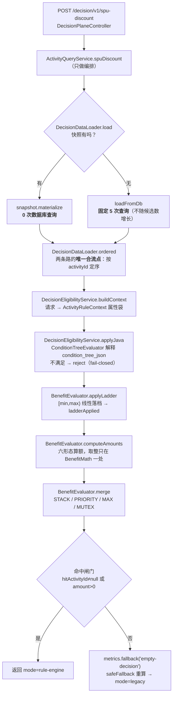
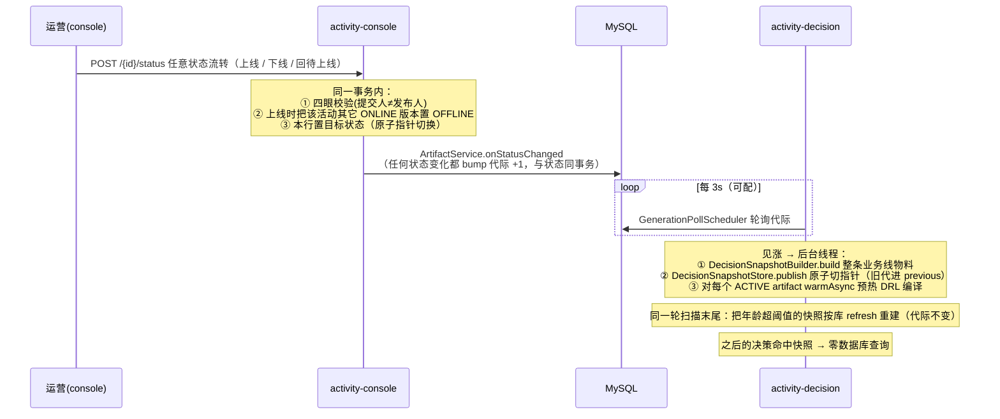

# 架构总览

> 本仓库长成了**两件东西**：一个多租户活动引擎平台（生产形态的读写分离 + 代际发布 + 快照），
> 和一套 Drools 教学 Steps（1–18）。这份文档只讲**架构**——模块怎么切、请求怎么走、
> 为什么这么切。各 Step 的教学细节看 [`steps-guide.md`](steps-guide.md)，
> 活动模块的**用法**看 [`activity-marketing.md`](activity-marketing.md)，
> 部署编排看 [`deployment.md`](deployment.md)，容量与引擎选型看 [`capacity-model.md`](capacity-model.md)。
>
> 现状锚：2026-08-11 HEAD。全 reactor 430 个测试（common 166 含 3 gated skip / drools-lab 0 / console 244 / decision 20）。
> 数字以 `./mvnw test` 输出的 `Tests run:` 汇总为准——**别用求和 surefire XML 的方式数**，会少数 52 个（见 [`../CLAUDE.md`](../CLAUDE.md) 坑 14）。

---

## 1. 模块拓扑

Maven 聚合父 pom + 4 个模块，跑起来是**两个独立 Spring Boot 应用**：

```
                       ┌─────────────────────────────────────────┐
                       │  activity-console   (app · 8081)        │
   写 ─────────────────▶│  写平面 + Step1–18 端点 + SPA 托管        │
   （运营 / 控制台）      │  ★ 唯一 DDL 执行者（root 账号）           │
                       └───────────┬──────────────┬──────────────┘
                                   │ depends      │ depends
                       ┌───────────▼──────┐   ┌───▼──────────────┐
                       │ activity-common  │   │  drools-lab      │
                       │ 活动引擎共享内核    │   │ Step1–18 教学库    │
                       │ domain/engine/   │   │ kmodule + DRL +  │
                       │ service/snapshot/│   │ .xls + .dmn      │
                       │ persistence/     │   │ (kie-ci/kie-dmn  │
                       │ tenant/metrics   │   │  等重依赖全在这)    │
                       └───────────▲──────┘   └──────────────────┘
                                   │ depends（**不依赖 drools-lab**）
                       ┌───────────┴─────────────────────────────┐
   读 ─────────────────▶│  activity-decision  (app · 8082)        │
   （C 端热路径）         │  只读 /decision/v1 + 代际轮询预热/建快照   │
                       │  ★ 只读 DB 账号 + ddl-auto: validate     │
                       └─────────────────────────────────────────┘
```

| 模块 | 类型 | 职责 | 关键约束 |
| --- | --- | --- | --- |
| `activity-common` | 库 | 活动引擎共享内核：`activity/{domain,engine,persistence,tenant,metrics,snapshot}` + 读路径服务 | 用 Drools 的地方走 `KieHelper` 运行时编译，**不用 kmodule / KieContainer / DMN** |
| `drools-lab` | 库 | Step 1–18 教学代码（`config/DroolsConfig`、`rules/`、`META-INF/kmodule.xml`） | 重依赖（`kie-ci` / `kie-dmn` / `drools-decisiontables` / `drools-xml-support`）**全被隔离在这里** |
| `activity-console` | **app · 8081** | 写平面 + 复用 drools-lab 暴露 Step 1–18 + 前端 SPA 托管（`/ui/`） | **唯一 DDL 执行者**；写端点受 `console-write-authority` 保护 |
| `activity-decision` | **app · 8082** | 只读决策热路径 `/decision/v1` + 发布代际轮询**兼快照构建/切换** | 只连只读账号；classpath 上**没有**写平面 bean，结构上就写不了 |

两个 app 的主类都在根包 `com.lrj.drools`（`ConsoleApplication` / `DecisionApplication`，
`scanBasePackages` / `@EntityScan` / `@EnableJpaRepositories` 都指 `com.lrj.drools`）。

**依赖方向是这套架构的第一条不变量**：`decision → common`，且 `decision ↛ drools-lab`。
它换来两件事——decision 的 jar 更轻（甩掉 maven-core / aether / DMN），以及
**写能力在物理上不可达**（没有写平面 bean 可注入）。这比"约定不要写"强得多。

---

## 2. 读写平面分工

拆平面的动机不是"微服务时髦"，是三条具体的边界：

| 维度 | console（写） | decision（读） |
| --- | --- | --- |
| 数据库账号 | root（可 DDL） | `decision_ro`（`GRANT SELECT` only） |
| `ddl-auto` | `update`（建表） | **`validate`**（由 `DecisionDdlGuardTest` 读源文件钉死） |
| 依赖 | common + drools-lab | **仅** common |
| 变更频率 | 低（运营操作） | 高（C 端每次下单） |
| 失败半径 | 运营配不了活动 | **发不出优惠 / 发错钱** |

由此推出本项目最重要的一条业务规则：**决策 ≠ 提交**。
决策服务连的是只读账号，物理上写不了库，所以**库存扣减只能在写平面**——
`POST /activity-marketing/{id}/claim` 才是权威扣减，决策侧一律只报价、不占库存。
秒杀试算和加价购报价都不扣库存，这不是疏漏，是分工。

`claim` 现在是**幂等**的：先插一条 `activity_grant` 发放流水（唯一约束 `tenant + order_id + activity_id`），
再走那条原子 UPDATE 扣减。**顺序不能反**——唯一约束必须在任何扣减发生之前拦住重复提交；
扣减失败会把刚插的流水删掉，不留「有账无货」。不传 `version` 时解析成**当前 ONLINE 版本**
（此前取最高版=草稿，闸门装在了另一行数据上），扣减谓词另含活动状态与时间窗。
冲正走 `POST /activity-marketing/{id}/release`（同样幂等，库存与每人限领额度一起还回）。

> `ActivityCandidate.inventory` 会一路装进候选和快照，但决策链路**从不读取**它——
> 运营配的"秒杀总量 500"在决策侧是声明式的，防超发全靠 claim 那条原子 UPDATE。

---

## 3. 决策链路：一次 `/decision/v1/spu-discount` 走了什么



**三层职责切分**（这是 2026-08 那轮重构的核心成果）：

| 层 | 类 | 只负责 |
| --- | --- | --- |
| 编排 | `ActivityQueryService` | 串六个步骤 + 回退，**不含业务算术** |
| 取数 | `DecisionDataLoader` | 快照优先，否则**固定 5 次**查询（重构前是 3N+2，N=候选数） |
| 资格 | `DecisionEligibilityService` | discount / gifts / addon **三通道唯一**的属性映射与资格淘汰 |
| 求值 | `BenefitEvaluator` + `BenefitMath` | 六形态算额与合并，**纯 Java** |

### 3.1 Drools 在这条链路上还剩什么

主链路**默认不进 Drools**。判据是一句话：**「这条规则需不需要*其它规则的结论*」**——
阶梯落档是标量分段函数、折扣合并是一次 reduce、资格条件树是单事实布尔谓词，三者都不需要。

全仓库现在只剩 **3 个** Drools 真实调用点：

| 调用点 | 干什么 | 在哪 |
| --- | --- | --- |
| `ruleRuntime.evalGift` | 买赠聚合（唯一被 eval 执行的 DRL） | `ActivityQueryService` 买赠通道 |
| `compileOrGet(eligDrl)` | 写平面**编译校验**（预览 / artifact 冻结），只编不跑 | `ActivityMarketingService` |
| `warmAsync(eligDrl)` | decision 侧发布预热编译 | `GenerationWarmService` |

`ActivityDrlBuilder.buildLadderDrl` 在生产运行时**没有执行方**——只被测试和容量基准当负载生成器用。
这个决策的量化依据见 [`capacity-model.md`](capacity-model.md)：移出 Drools 省了 **~100× 内存 + ~67× 决策 CPU**。

> **回滚手段**（旧的灰度开关已退役）：部署级回滚上一版 jar + decision 侧快照代际 `rollback`。
> 进程内**已经没有**"切回另一套求值语义"的开关；`java-benefit-eval` / `java-eligibility-eval`
> 两个 `@Value` 字段代码里从不读取，配 false 也不会把生产切回 DRL
> （由 `ActivityQuerySafetyFallbackTest#legacyFalseFlagsCannotSwitchProductionBackToDrools` 钉死）。

### 3.2 决策响应要自证物料来源：`provenance` 与诊断端点的分工

`activity.decision.source` 这个指标回答的是「整体上多少比例走了快照」，
而运营/QA 在验证页上问的是「**我这一次**看到的结论，是照着数据库现状算的，还是照着一份可能落后的快照算的」。
后者只有响应自己能回答，于是 `DecisionProvenance`（`source` + `generation` + `buckets`）
贯通了 `Materials` → `DiscountView` / `GiftView` / `AddOnOptions` / `AddOnQuote` 四个响应契约（都保留了兼容构造器），
决策审计日志（**仅红包 `spu-discount` 通道**，`auditLog` 唯一调用点在该出口；买赠与加价购不落盘）也一起落 `source` / `generation`——只有活动版本而没有代际时，
「活动版本对、但快照是旧代」这类工单在日志里查不出来。

- `generation` 取的是参与本次决策的桶里**最落后的那一代**（一次决策会合并该租户所有业务线的桶）。
  取最小不取最大，是因为这个数要回答的是「我刚发布的那次进去了没有」——任何一个桶落后就意味着「还没全进去」；
- **业务契约到此为止**。`builtAt` / `ageSeconds` / 桶清单交给诊断端点 `GET /decision/v1/snapshot[?activityId=]`。
  理由不是"字段太多"：`DecisionSnapshotStore.oldestAgeSeconds`（gauge 用的那个）是**跨租户**口径
  （调度线程与指标线程没有租户上下文），与决策实际读的 `forTenant` **不是同一个数**，
  混进业务契约会让 SRE 与运营拿着两个都对的数字对不上账；
- 光看决策一侧的 `generation` 判断不了「我刚发布的那次进去了没有」（7 可能是最新，也可能落后三代），
  所以写平面另开了 `GET /activity-marketing/generation?bizLine=`（读 `activity_generation` 这本账，行不存在返回 0）
  当**参照物**——两个数的**差值**才是信息；
- 诊断端点存在的真正理由：provenance 三个值在最要命的那条故障上**全绿**——
  `bizLine` 为空的活动进不了任何桶（构建期按 bizLine 精确匹配），而兜底重建只遍历**已存在**的桶、
  永远建不出不存在的那个。此时决策照常走快照、代际正常、快照也很新，只是这个活动根本不在里面，
  页面上与「活动确实不该命中」完全同形。带 `?activityId=` 时它直接回答「在哪个桶 / 不在任何桶」。
  它**只读、不发起决策**，因此也不占 `ACTIVITY_TAG_CAP` 的标签位。

---

## 4. 权益形态与合并策略

`red_package_amount_unit` 是**判别位**——同一个 `redPackageAmount` 字段按单位解释成不同含义：

| 单位 | `BenefitForm` | `redPackageAmount` 的含义 | 写平面强制约束 |
| --- | --- | --- | --- |
| `元` / null | `AMOUNT` | 直接减的钱 | 阶梯分档另配 `redPackageRangeAmount` |
| `折` | `RATIO_ZHE` | 折数 (0,10)，8 = 八折 | **必须**配 `redPackageMaxDiscount>0`，且不许同时配阶梯 |
| `价` | `FIXED_PRICE` | 一口价（秒杀）卖多少 | 减免 = **作用域基数** − 一口价 |
| `件折` | `NTH_ZHE` | 折数，第几件在 `redPackageRangeAmount` 的 `{"nth":N}` | 决策入参必须带 `lines`（订单行） |

加上「随机金额」（`redPackageTakeType=RANDOM_AMOUNT` + 区间）与「阶梯」，共**六形态**。

**「作用域基数」是本包的语义核心**（`BenefitEvaluator.baseAmount`）：一口价与折算的是
「**本活动的商品**一共多少钱」，不是「订单一共多少钱」。绑定关系因此从"候选筛选器"升格成"权益作用域"，
三档判定顺序不能反：

1. **作用域未知**（`scopedSpuIds == null`）→ 整单。手工构造的候选与还没接上作用域的装配路径走这里（兼容承诺）；
2. **作用域覆盖了本次请求的全部 SPU** → 整单。此时两者本就是同一批东西，今天绝大多数流量落在这一档；
3. **作用域是真子集** → 只能靠订单行分摊；**拿不到行就 fail-closed 淘汰候选**，绝不用整单金额顶替。

第 3 档正是这套改造要修的那笔钱：一个只绑了 B 的「9.9 一口价」，在「A 5000 元 + B」的车里
曾被算成 `5009.9 − 9.9`，**整车按 9.9 成交**。第 N 件折不走基数，但同样受作用域约束——
只在**作用域内的订单行**里数「第 N 件」，车里作用域外的商品不能替它凑件数。

**三条容易踩的判别顺序**（都在 `BenefitEvaluator.computeAmounts`）：

1. **形态判别必须排在 takeType 之前**——否则 API 手造的「折 + takeType=2」会被抢进随机分支，永远走不到折扣计算；
2. **随机分支必须排在 `redPackageAmount==null` 的 guard 之前**——随机金额来自 `redPackageRangeAmount`，不是 `redPackageAmount`；
3. **未知单位一律回落金额型**——脏数据表现为"按旧行为发"，而不是"按猜出来的形态发"。

**取整只能有一份**（`BenefitMath` 的静态方法），一律 `RoundingMode.DOWN` + scale 2。
四舍五入会系统性多发；各写一遍迟早漂移，表现是同一张券在两条路上差几分钱。

**「算不出金额」必须真的淘汰候选**，不能留一个 0 元幽灵挤掉真优惠。判据是 `ladderApplied`
这个**落档留痕**，不是金额是否为 0——首档 reward=0 是运营配得出来的合法 0 元优惠，用金额判别会误杀。

合并策略（`BenefitEvaluator.merge`，一次 O(N) 遍历）：

| 策略 | 语义 | 主活动怎么选 |
| --- | --- | --- |
| `STACK` | 金额累加 | 按 priority（**小者胜**） |
| `MAX` | 单选 | 比金额 |
| `PRIORITY` / `MUTEX` | 单选（两者走**完全同一条分支**） | 比 priority，同 priority 再比金额 |

**出口封顶**（`BenefitEvaluator.capToOrderAmount`，无论哪种策略都走这一个出口）：
最终 `hitAmount = min(hitAmount, orderAmount)`，被截断时置 `clamped=true` 并计一次 `activity.decision.clamped`。
此前这里**只有下界没有上界**——三张「满 100 减 50」打在 120 元订单上会返回 150，负的应付金额直接交给下游订单系统。

> **截断本身不是目的，计数才是。** 能触发封顶的配置几乎一定配错了（门槛写反 / 面额多一个零 / 叠加没设上限），
> 而这类错误在补这个指标之前监控上是**全盘绿灯**：回退率 0、耗时正常、命中数只是稍高。
> `orderAmount` 缺省或 ≤0 时**不封顶**——`AMOUNT` 型本就不要求上游传订单金额，此时无从判断是否超发；
> 这是一条有意保留的边界，真要收紧应该在**入参契约**上要求订单金额，而不是在这里猜。

> `redPackageRangeAmount` 是**双用途列**，靠 JSON 顶层类型互斥：数组归阶梯解析器，对象归随机区间解析器。
> 写成 `[{"min":5,"max":20}]` 会被阶梯路径认领。

---

## 5. 发布模型：版本 → 代际 → 快照 → 预热

这是跨进程生效的完整链条，也是"改了活动多久生效"的答案：



**版本模型的两条要点**：

- **编辑不下线正在服务的版本**——线上版与草稿并存，`create` 带 `activityId` 即 version+1 出草稿；
- **上线时在同一事务里退役该活动其它 ONLINE 版本**——这是原子指针切换，不是"先下线再上线"的两步。

> **bump 唯一的例外是 `bizLine` 为空**：`activity_generation.biz_line` 是 NOT NULL，硬 bump 会在**同一个事务**里
> 抛非空约束违例、把刚写下的状态一起回滚——「下线传播不出去」当场升级成「下线根本做不到」。
> 所以此时只落状态、跳过 bump 并打 warn。也不能编一个哨兵 bizLine 顶上：快照构建按 bizLine 精确匹配，
> 哨兵桶谁也匹配不上，而拿 null 去构建会让过滤条件短路成「该租户所有业务线一锅端」，再与真桶合并 → 同一活动算两遍。
> 它的真正含义是：**没有 bizLine 的活动本来就进不了任何决策快照**（见 §3.2），没有代际可传播。

**批量上下线**（`POST /bulk-status`）**逐条处理、失败不影响已成功项**，一律返回 200 + 部分失败回执
（部分失败是正常结果，不是错误）。`version` 允许为 null，但调用方应按列表行传显式 version，
否则会打到草稿而不是正在服务的版本。

**快照的边界**：

- 命中快照的决策**零数据库查询**；没有快照自动回落走库；
- console 进程里**没有** `DecisionSnapshotBuilder` 的调用方（全仓只有 decision 侧的 `GenerationWarmService` 调 `publish`），
  所以 console 的 store 恒空、天然走库——两条路的等价性由 `SnapshotParityTest` 守；
- `rollback` **只保留一代**且是**一次性**的：回滚后 `previous` 变空，滚不回去。这是显式设计；
- **陈旧快照兜底重建**：poller 每轮扫完代际后，把 `builtAt` 年龄超过
  `activity.marketing.snapshot.max-age-ms`（默认 60000，≤0 关闭；**两份 `application.yml` 里都没有这个 key，
  默认值只在代码里**）的快照按数据库真相重建一遍。它守的不是某一个已知 bug，而是「信号漏发」这一整类故障
  （bump 没提交 / 轮询线程被拖死后恢复 / 构建期抛异常导致 `lastSeen` 没更新），后果从**永久**降为**一轮**。
  走 `DecisionSnapshotStore.refresh` 而**不是** `publish`：它不是一次发布，不能占回滚槽位——
  否则 `rollback` 会退到几十秒前的自己，等于没回滚（`OfflinePropagationTest#refreshDoesNotConsumeRollbackSlot`）。
  重建失败保留旧快照、下轮再试，此时 `activity.decision.snapshot.age.seconds` 会持续上涨。

---

## 6. 多租户与认证

隔离靠 **Hibernate 判别式（discriminator）**，不是 schema/database 策略：
每个实体一个 `@TenantId String tenantId` 映射到 `tenant_id` 列，
`MultiTenancyConfig` 把 `TenantIdentifierResolver` 塞进 `MULTI_TENANT_IDENTIFIER_RESOLVER`，
Hibernate 给每条 SQL **自动追加** `tenant_id = ?`。

**业务代码从不手写租户谓词**，也没有任何 `nativeQuery`（会绕过判别式）——这两条由
`TenantArchGuardTest` 结构守卫钉死。

两档由 `activity.tenant.auth.enabled`（默认 false）切换：

| 档 | 租户从哪来 | 过滤器 | 挂在哪些 URL |
| --- | --- | --- | --- |
| header 档（dev） | `X-Tenant-Id` 请求头 | `TenantContextFilter` | `/activity-marketing/*` **与** `/decision/v1/*` |
| auth 档（默认部署） | JWT 的 `aud` → 租户，`sub` → 操作者 | `JwtTenantFilter`（挂在同时匹配两平面的安全链上） | 同上 |

> ⚠️ **新增一个受租户约束的路径，必须同步扩 `TenantContextFilter` 的 URL 模式**。
> 这里踩过一次：加决策平面时漏了 `/decision/v1/*`，`X-Tenant-Id` 被**静默忽略**，
> 全部请求落到 dev-default 兜底，表现为「A 租户查到别人的活动」。
> 单元测试大多跑在 dev-default 下，**这类缺口只有端到端才照得出来**（现由 `DecisionTenantHeaderTest` 钉死）。

auth 档的完整鉴权链：

```
OutageTolerantJwks (JWKS 验签, RS256, 容忍 IdP 短时不可用)
  → JwtTimestampValidator + JwtIssuerValidator + AudienceTenantValidator (aud 必须解析到已知租户，否则 401)
  → AuthorizationFilter (写端点 hasAuthority(console-write-authority))
  → JwtTenantFilter (aud→TenantContext, sub→ActorContext)
  → 业务
```

受 `console-write-authority` 保护的 5 个写端点（授权规则写在 `ActivityResourceServerConfig`）：
`create` / `{id}/status` / `bulk-status` / `{id}/claim` / `{id}/release`。
注意 `bulk-status` 是两段路径，`/activity-marketing/*/status` 这个模式**匹配不到**，必须单列。
`release` 必须一起设防的理由是它**会把库存加回去**并解除该用户的限领占用——
不设防的话反复调它就能把一个限量活动的库存刷到任意大。

---

## 7. 数据模型

14 张表 / 14 个 Spring Data 仓库。**活动配置类的表**按 **`activityId` + `version` + `is_del`** 做版本化软删；
账本与字典类的四张（`activity_generation` / `activity_grant` / `activity_idempotency` / `demo_product`）没有 `is_del`，
它们记的是发生过的事实，不参与版本化。主键一律自增代理键（唯一例外 `demo_product` 用业务键 `spu_id`）。

| 表 | 职责 | 写入时机 |
| --- | --- | --- |
| `activity_manage` | 活动主表（状态 / 版本 / 时间窗 / 库存 / 红包配置） | create / status / claim |
| `activity_rule` | 红包规则层 | create |
| `activity_condition` | 资格条件（`condition_tree_json` + 翻译好的 DRL 约束） | create |
| `activity_gift` | 买赠 / 加价购的赠品与换购品 | create |
| `activity_spu_binding` | 活动 ↔ SPU 绑定（手工 `bind_source=0` / 选品池自动） | create |
| `activity_pool_ref` + `product_pool` + `product_pool_rule` | 选品池与规则 | create |
| `activity_strategy` | 按 (bizLine, 场景) 的合并策略 | 运营配置 |
| `activity_artifact` | 冻结的发布物料（含编译校验过的 DRL） | create 时冻结（schema 漂移时改标 NEEDS_REBUILD） |
| `activity_generation` | 发布代际计数器（**无 `@TenantId`**，decision 侧跨租户轮询它） | **任何**状态变化 bump |
| `activity_idempotency` | 创建幂等（按 `requestId`） | create |
| `activity_grant` | 发放流水（claim 幂等键 + 每人限领计数 + 冲正 + 对账），唯一约束 `uk_grant_tenant_order_activity` | claim / release |
| `demo_product` | 演示商品 | seeder |

> `activity_grant` **不复用 `activity_idempotency`**：后者的键是客户端生成的 `requestId`，
> 语义是「这个请求处理过没有」，可以随重试策略变化；前者的键是业务事实（哪一单、哪个用户、哪个活动），
> 语义是「这份优惠发出去没有」，是账。混在一起的后果是换个客户端重试实现就能把同一单领两次。
> 它**只在写平面被写入**——decision 连只读账号，决策留痕走的是结构化日志 + 指标那条路。

**全仓只有三条 `@Modifying` 自定义 SQL，都在 `ActivityManageRepository`**（扣库存 / 还库存 / 软删版本），
其中扣库存那条是关键：

```sql
update ActivityManageEntity e set e.inventory = e.inventory - :n, ...
 where e.activityId = :activityId and e.version = :version and e.isDel = 0
   and e.activityStatus = 1
   and e.activityStartTime <= :now and e.activityEndTime >= :now
   and e.inventory is not null and e.inventory >= :n
```

**「判余量」和「减一」压进同一条 UPDATE**，绝不能先 SELECT 再 UPDATE
（check-then-act 竞态，低并发测不出、大促必现）。返回 0 = 没抢到，调用方不能忽略返回值。
状态与时间窗谓词也在这条 WHERE 里：少了它们，已下线、未开始、已结束的活动库存**都能被扣干净**。

反过来，归还库存的 `incrementInventory` **刻意不带状态与时间窗**——一笔活动期内领走的优惠，
用户可能在活动结束之后才退款，那时若因为「活动已结束」而拒绝归还，库存就永久蒸发了。
防重复归还靠流水的 `state`（只有非 `RELEASED` 的记录才走得到那条 SQL），不是靠谓词。

> MySQL 下大字段不能用 `@Lob`（会建成 64KB 的 `blob` / `text` 被截断），
> 本项目用 `@JdbcTypeCode(SqlTypes.LONGVARBINARY / LONGVARCHAR)` 映射成 `longblob` / `longtext`。

---

## 8. 部署拓扑

6 个 compose 服务；console 与 decision 由**同一份 `deploy/Dockerfile`** 以 `--build-arg MODULE=` 构建：

```
浏览器 :8095
   │
   ├─ /ui/**            → gateway 本地静态（Vue SPA + history 回退 + 自托管字体）
   ├─ /api/decision/**  → rewrite → decision:8080/decision/v1/**
   ├─ /api/console/**   → rewrite → console:8080/activity-marketing/**
   └─ /**               → console:8080（Step1-18 / /actuator / 原始 /activity-marketing）
                              │                    │
                         console(root)        decision(decision_ro)
                              └────── MySQL 单库双账号 ──────┘
                              └──→ Prometheus :9090 → Grafana :3001
```

**启动依赖链是有讲究的**：`mysql (healthy) → console (healthy, 建表) → decision (validate) → gateway`。
decision 必须 `depends_on: console: service_healthy`——`service_started` 不够，会撞 `missing table`。

> ⚠️ **前端 `/ui/` 由 gateway 镜像托管，不在 console 的 JAR 里**。
> 改了前端只 `--build console` 是没用的，页面纹丝不动——要重建 `gateway`。反过来改了后端才重建 console。

---

## 9. 可观测性

`DecisionMetrics` 打 `activity.decision.{duration,fallback,candidates,source,hit,clamped,amount,reject,snapshot.count,snapshot.age.seconds}`
+ `activity.rule.{compile,fire.ceiling,cache.*}`。

**回退率是头号告警项**——回退会**静默改变实际发放金额**，此前它只有一条 `log.warn`，线上完全看不见。
另外两条同类读数：`clamped` 正常业务恒 0，出现一次就是疑似配错（见 §4 出口封顶）；
`snapshot.age.seconds`（最旧快照年龄，无快照时 -1）是**下线传播断掉时唯一会动的读数**。
后者是 `DecisionSnapshotStore.oldestAgeSeconds` 的**跨租户**口径，与 `GET /decision/v1/snapshot`
按租户返回的 `ageSeconds` **不是同一个数**，多租户下永远对不上，别拿来互相印证（见 §3.2）。

**`activityId` 不能无上限地当 Prometheus 标签**：活动是运营随手能建的，序列数不受工程控制，
基数爆炸的代价是大促当天整套监控一起挂。`DecisionMetrics.ACTIVITY_TAG_CAP = 200`，
超出部分并入 `__over_cap__` 哨兵（总量仍准，只是分不出是哪几个），响应里原样带出**不隐藏**。

> 两组指标的 `scene` 标签**对不上**：`decisionSource` 用 `ActivityType.name()`
> （`RED_PACKAGE` / `BUY_AND_GET` / `ADD_ON_PURCHASE`），而 duration / fallback / candidates / hit
> 用 `spu-discount` / `gifts` / `addon`。按 scene 标签 join 会得到空集。
> `reject` 还有第三种口径：资格淘汰打的是通道名，而算额淘汰打的是 `benefit`（**阶段**，与通道并列在同一个标签里）。
>
> 另：加价购通道没有 duration / candidates / hit 指标（`AddOnPurchaseService` 没注入 `DecisionMetrics`）。

---

## 10. 教学层：drools-lab（Step 1–18）

代码全在 `drools-lab`，端点由 console 暴露。这一层与活动引擎**没有代码耦合**——
它走 classpath 的 `kmodule.xml` + `KieContainer`，活动引擎走 `KieHelper` 运行时编译，两套机制互不相干。

18 个 Step 覆盖：facts/when-then → salience/join → accumulate/modify → not/exists →
agenda-group → listener 可观测 → 决策表 → CEP 滑窗 → 热加载 → 会话持久化 → Stateless 对比 →
TMS → 后向链/query → 引擎安全护栏 → Micrometer 指标 → KieScanner/KJAR → DMN → 营销活动资格判定。

完整端点表与各 Step 的 DRL 语义注意点见 [`steps-guide.md`](steps-guide.md)。

> `drools-lab` **不产出可执行测试**——唯一的 `@Test` 类 `VipDiscountSheetGenerator` 命名不匹配
> surefire 默认模式（`*Test` / `Test*` / `*Tests` / `*TestCase`），从不运行。这是有意的（它是个生成器）。

---

## 11. 关键不变量（改代码前先读这几条）

按"违反后果的严重程度"排序：

| # | 不变量 | 违反的后果 | 守卫 |
| --- | --- | --- | --- |
| 1 | 库存扣减必须是**一条**原子 UPDATE，且只在写平面 | 超发；低并发测不出、大促必现 | `FixedPriceAndClaimTest$NoOversell` |
| 2 | `claim` 必须**先插流水再扣库存**，顺序不能反 | 反过来时并发的同一单会各自扣成功、只能靠事务回滚兜住；且扣减成功而插入失败会留下「扣了库存却没有账」的黑洞 | `GrantLedgerTest` |
| 3 | 取整只在 `BenefitMath` 一处，一律 `DOWN` | 同一张券两条路差钱 | `BenefitMathTest`（21 例） |
| 4 | 出口减免额**不得超过订单金额**，截断要计数 | 负的应付金额交给下游订单系统，且监控全绿 | `DecisionGoldenSetTest$Ratio#stackedRatiosAreCappedAtOrderAmount` |
| 5 | 走库路径的候选身份必须按**当前线上版本**收窄 | 编辑收窄绑定后被撤掉的 SPU 照发钱（`AMOUNT` 形态不看作用域），且两条路发不同的钱 | `SnapshotParityTest#narrowedBindingStopsPayingOnBothPaths` |
| 6 | 算不出金额 → **淘汰候选**，不留 0 元幽灵 | 0 元幽灵挤掉真优惠 | `NotApplicableCandidateTest`（14 例） |
| 7 | 候选进合并前必须有**确定序**（loader 出口按 activityId 排） | 快照侧倒排值是 `Set.copyOf`、迭代序随 JDK SALT 每次启动翻面 → 金额打平时的赢家在重启后整片翻面，且两条路不一致 | — （`DecisionDataLoader.ordered`，无专测） |
| 8 | **任何**活动状态变化都要 bump 发布代际（不只是上线） | 下线传播不出去，decision 继续按原配置发钱，止损开关与仪表盘一起骗人 | `OfflinePropagationTest` |
| 9 | 快照必须有 `builtAt` 兜底重建（`refresh`，不占回滚槽位） | 任何一次「信号漏发」都从一轮升级成永久 | `SnapshotStaleRebuildTest` |
| 10 | decision 的 `ddl-auto` 必须是 `validate` | 只读平面带着 DDL 权限跑 | `DecisionDdlGuardTest` |
| 11 | 受租户约束的新路径要同步扩过滤器 URL 模式 | 跨租户串数据，且**静默** | `DecisionTenantHeaderTest` |
| 12 | 不手写 `tenant_id` 谓词、不用 `nativeQuery` | 绕过判别式 → 跨租户泄漏 | `TenantArchGuardTest` |
| 13 | 六形态判别顺序（形态 → takeType → null guard） | 按错误形态发钱 | `DecisionGoldenSetTest`（52 例）+ `BenefitFormValidationTest` |
| 14 | 旧的 `java-*` 开关配 false **也不能**切回 DRL | 旧 DRL 不认新形态，按错误形态发钱 | `ActivityQuerySafetyFallbackTest` |
| 15 | 决策响应必须自证物料来源 `provenance`；它是**唯一不进** parity 逐字段 sweep 的字段（两条路它必须**不同**） | 把它并进 sweep 等于要求两条路谎报来源；没有它则「照着旧快照算的」在响应与日志里都查不出来 | `SnapshotParityTest`（provenance 段） |
| 16 | `activityId` 标签有基数上限 | 大促当天监控一起挂 | `DecisionMetricsTest` |
| 17 | DRL 里不要随便加 `update($fact)` | 死循环，请求挂住 | — （见 `../CLAUDE.md` 坑 3） |

---

## 12. 相关文档

| 想知道什么 | 看哪份 |
| --- | --- |
| 各 Step 详解 + REST 接口全表 + DRL 语义 | [`steps-guide.md`](steps-guide.md) |
| 活动模块怎么用（建活动 / 六形态造数 / 决策调用） | [`activity-marketing.md`](activity-marketing.md) |
| 部署编排 / 网关 / 双账号 / 观测 / 容灾 | [`deployment.md`](deployment.md) |
| 能挂多少活动、Drools vs QLExpress vs 纯 Java | [`capacity-model.md`](capacity-model.md) |
| 项目里有哪些技术点（面试 / 答辩向） | [`tech-highlights.md`](tech-highlights.md) |
| Drools 能力全景与选型决策树 | [`drools-capabilities.md`](drools-capabilities.md) |
| RETE / Phreak 算法直觉 | [`rete-intuition.md`](rete-intuition.md) |
| 给 AI 的项目指南（含 18 条已踩过的坑） | [`../CLAUDE.md`](../CLAUDE.md) |
