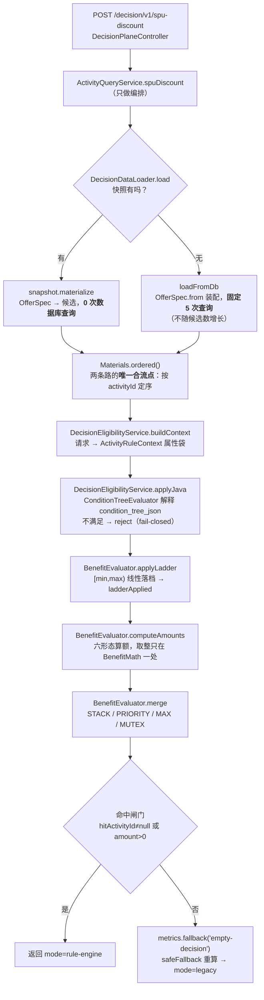
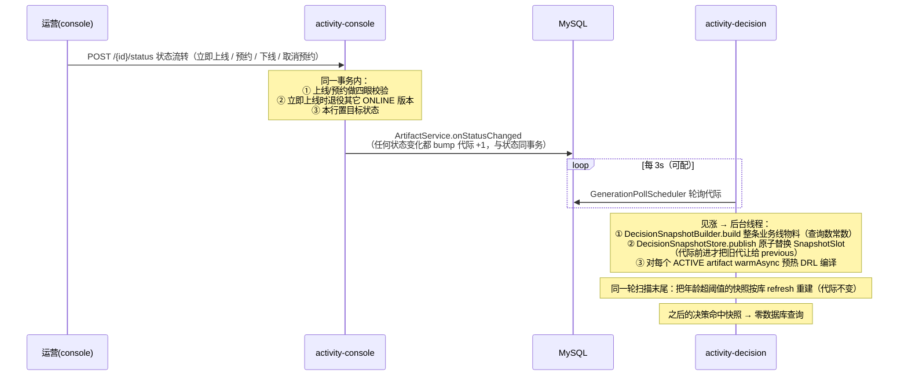

# 架构总览

> 本仓库长成了**两件东西**：一个多租户活动引擎平台（生产形态的读写分离 + 代际发布 + 快照），
> 和一套 Drools 教学 Steps（1–18）。这份文档只讲**架构**——模块怎么切、请求怎么走、
> 为什么这么切。各 Step 的教学细节看 [`steps-guide.md`](steps-guide.md)，
> 活动模块的**用法**看 [`activity-marketing.md`](activity-marketing.md)，
> 部署编排看 [`deployment.md`](deployment.md)，容量与引擎选型看 [`capacity-model.md`](capacity-model.md)。
>
> 现状锚：2026-08-12 HEAD。全 reactor 476 个测试（common 193 含 3 gated skip / drools-lab 0 / console 256 / decision 27）。
> 数字以 `./mvnw test` 输出的 `Tests run:` 汇总为准——**别用求和 surefire XML 的方式数**，会少数 52 个（见 [`../CLAUDE.md`](../CLAUDE.md) 坑 14）。
>
> 上一轮结构性重构（分支 `refactor/activity-design`，8 个提交）的**对外可见契约变更**单独成册：
> [`plans/activity-design-refactor-0812-1232/BREAKING-CHANGES.md`](plans/activity-design-refactor-0812-1232/BREAKING-CHANGES.md)。
> 那轮的总体目标是**行为等价**——发钱金额零变化，金标集 52 例 / `SnapshotParityTest` / `DecisionQueryCountTest` 全程绿。

---

## 1. 模块拓扑

Maven 聚合父 pom + 4 个模块，跑起来是**两个独立 Spring Boot 应用**：

```
                       ┌─────────────────────────────────────────┐
                       │  activity-console   (app · 8081)        │
   写 ─────────────────▶│  写平面 + Step1–24 端点 + SPA 托管        │
   （运营 / 控制台）      │  ★ 唯一 DDL 执行者（root 账号）           │
                       └───────────┬──────────────┬──────────────┘
                                   │ depends      │ depends
                       ┌───────────▼──────┐   ┌───▼──────────────┐
                       │ activity-common  │   │  drools-lab      │
                       │ 活动引擎共享内核    │   │ Step1–24 教学库    │
                       │ domain/engine/   │   │ kmodule + DRL +  │
                       │ service/snapshot/│   │ .xls + .dmn      │
                       │ persistence/error│   │ (kie-ci/kie-dmn  │
                       │ tenant/metrics   │   │  等重依赖全在这)    │
                       └───────────▲──────┘   └──────────────────┘
                                   │ depends（**不依赖 drools-lab**）
                       ┌───────────┴─────────────────────────────┐
   读 ─────────────────▶│  activity-decision  (app · 8082)        │
   （C 端热路径）         │  只读 /decision/v1 + 代际轮询预热/建快照   │
                       │  ★ 只读 DB 账号 + ddl-auto: validate     │
                       └─────────────────────────────────────────┘
```

| 模块 | 类型 | 职责 | 关键约束 |
| --- | --- | --- | --- |
| `activity-common` | 库 | 活动引擎共享内核：`activity/{domain,engine,persistence,error,tenant,metrics,snapshot}` + 读路径服务 | 用 Drools 的地方走 `KieHelper` 运行时编译，**不用 kmodule / KieContainer / DMN**；只放两平面**都要**的东西——只有 console 用的选品池匹配（`ActivityPoolMatchService`）已上浮到 console |
| `drools-lab` | 库 | Step 1–24 教学代码（`config/DroolsConfig`、`rules/`、`META-INF/kmodule.xml`） | 重依赖（`kie-ci` / `kie-dmn` / `drools-decisiontables` / `drools-xml-support`）**全被隔离在这里** |
| `activity-console` | **app · 8081** | 写平面 + 复用 drools-lab 暴露 Step 1–24 + 前端 SPA 托管（`/ui/`） | **唯一 DDL 执行者**；写端点受 `console-write-authority` 保护 |
| `activity-decision` | **app · 8082** | 只读决策热路径 `/decision/v1` + 发布代际轮询**兼快照构建/切换** | 只连只读账号；classpath 上**没有**写平面 bean；取数与快照构建注入的是 `*ReadRepository`（`save`/`delete` 在**类型上**不存在），结构上就写不了 |

两个 app 的主类都在根包 `com.lrj.drools`（`ConsoleApplication` / `DecisionApplication`，
`scanBasePackages` / `@EntityScan` / `@EnableJpaRepositories` 都指 `com.lrj.drools`）。

Docker 编排另有一个独立的 XXL-JOB Admin：它通过容器内网调用 console 的 9999 执行器端口，只负责
`activityLifecycleSweep` 的触发、重试、日志与人工操作；活动状态不复制到调度库。Handler 仍进入 console 的
`ActivityLifecycleScheduleService → ActivityLifecycleTransitionService`，因此跨租户隔离、逐活动事务、悲观锁、
幂等和发布代际都属于写平面。开发环境可用 `local` 模式保留 Spring `@Scheduled`，Docker 默认 `xxl`，
`off` 用于测试或停用，三个触发模式互斥。decision 的代际轮询维护每个实例的本地快照，仍留在进程内调度。

**依赖方向是这套架构的第一条不变量**：`decision → common`，且 `decision ↛ drools-lab`。
它换来两件事——decision 的 jar 更轻（甩掉 maven-core / aether / DMN），以及
**写能力在物理上不可达**（没有写平面 bean 可注入）。这比"约定不要写"强得多。

---

## 2. 读写平面分工

拆平面的动机不是"微服务时髦"，是三条具体的边界：

| 维度 | console（写） | decision（读） |
| --- | --- | --- |
| 数据库账号 | root（可 DDL） | `decision_ro`（`GRANT SELECT` only） |
| `ddl-auto` | `update`（建表） | **`validate`**（由 `DecisionDdlGuardTest` 读源文件钉死） |
| 仓库类型 | `JpaRepository`（14 个） | 取数与快照构建走 **`Repository<T,ID>`（6 个 `*ReadRepository`）**——没有 `save` / `delete` / `flush` |
| 依赖 | common + drools-lab | **仅** common |
| 变更频率 | 低（运营操作） | 高（C 端每次下单） |
| 失败半径 | 运营配不了活动 | **发不出优惠 / 发错钱** |

「decision 写不了库」现在有**三道**保证，而且一道比一道早：只读账号（运行期）→ `ddl-auto: validate`（启动期）
→ **类型级只读边界**（编译期）。第三道是补上去的：在它之前，读路径上任何一次手滑的 `save(...)`
都能编译通过、也能跑过全部单测（测试库是**可写的 H2**），只在生产那条只读连接上炸。
`DecisionDataLoader` 与 `DecisionSnapshotBuilder` 现在注入的六个 `*ReadRepository` 继承的是
`Repository<T, ID>` 而不是 `JpaRepository`，写方法**在类型上根本不存在**。
`DecisionReadRepositoryGuardTest` 守两条：`*ReadRepository` 一律不许继承 `CrudRepository`，
且这两个类的仓库字段一个都不能是 `CrudRepository` 的子类型（否则第一条守住了、注入换回可写仓库照样绕过）。
**边界只覆盖取数层**：decision 侧的 `GenerationWarmService` 读代际与 artifact 用的仍是普通 `JpaRepository`，
那一段的只读保证还是靠数据库账号。判别式租户过滤与仓库继承谁无关——Hibernate 在 SQL 层加谓词，
派生查询照样带 `tenant_id = ?`。

由此推出本项目最重要的一条业务规则：**决策 ≠ 提交**。
决策服务连的是只读账号，物理上写不了库，所以**库存扣减只能在写平面**——
`POST /activity-marketing/{id}/claim` 才是权威扣减，决策侧一律只报价、不占库存。
秒杀试算和加价购报价都不扣库存，这不是疏漏，是分工。

`claim` 现在是**幂等**的：先插一条 `activity_grant` 发放流水（唯一约束 `tenant + order_id + activity_id`），
再走那条原子 UPDATE 扣减。**顺序不能反**——唯一约束必须在任何扣减发生之前拦住重复提交；
扣减失败会把刚插的流水删掉，不留「有账无货」。不传 `version` 时解析成**当前 ONLINE 版本**
（此前取最高版=草稿，闸门装在了另一行数据上），扣减谓词另含活动状态与时间窗。
冲正走 `POST /activity-marketing/{id}/release`（同样幂等，库存与每人限领额度一起还回）。

这三个端点（`claim` / `release` / `grants`）的实现已从 `ActivityMarketingService` 拆到独立的 **`GrantService`**
（前者保留同名委派方法，controller 与既有调用方不动）：
台账与配置写入口零共享状态，唯一的公共知识是「当前是哪一版」，而那两条**互斥**定义现在由
**`ActivityVersionResolver`** 具名化——`latestDraftVersion`（最高未删除版，编辑基线 / `changeStatus` 缺省）
与 `currentOnlineVersion`（最高 ONLINE 版，`claim` 缺省，也是决策侧认的那一版）。
「秒杀库存的闸门装在草稿上」正是这两条定义混用的产物，散在五个调用点里就地解释时没有一处读得出来。

> **`claim` 的失败不再是一个恒定的 409**：`ClaimResult` 带一个 `@JsonIgnore` 的 `FailureKind`
> （响应体一字节未变，只用于服务端分流），由 controller 里一个**不写 `default` 的 switch 表达式**映射成
> 400（缺参 / 数量非正 / 限领活动没带 `userId`）、404（活动或版本不存在）、409（余量不足 / 超出每人限领）。
> 理由是 409 的标准语义是「重试可能成功」——压在同一个码里时，**「参数写错」这一类会被下游无限重试到活动结束**。
> 同批还有两处状态码修正：四眼校验失败 409 → **403**（「不该由你来做」，重试永远不会成），
> `release` 的 `orderId` 传空串 404 → **400**（404 会让调用方以为「这一单没领过、不用冲正」，从而放弃冲正）。
> 完整清单见 [`BREAKING-CHANGES.md`](plans/activity-design-refactor-0812-1232/BREAKING-CHANGES.md)。

> `ActivityCandidate.inventory` 会一路装进候选和快照，但决策链路**从不读取**它——
> 运营配的"秒杀总量 500"在决策侧是声明式的，防超发全靠 claim 那条原子 UPDATE。

### 2.1 失败怎么出去：一层领域异常，两个**刻意不同**的 advice

分类信息此前在抛出点存在、到出口就丢了：抛出方明明知道这是「四眼拒绝」还是「并发重复」，
却只能选 `IllegalArgumentException` / `IllegalStateException`，剩下的语义只活在 message 字符串里——
下游要再用它就只能去**匹配 message**（`msg.contains("uk_am_tenant_request")` 就是这么来的，
而那串文案是数据库自己拼的、随驱动版本变）。现在有 `ActivityException` + `ActivityErrorCode`（**自带 `httpStatus`**），
message 与改造前逐字一致（它是面向运营的中文提示，前端有测试直接断言），旁边多一个机器可读的 `code`。
它继承 `RuntimeException` 而不是 ISE，是为了能**穿过**迁移期保留的旧 `catch` 落到 advice 上。

两个平面各挂一个 `@RestControllerAdvice`，`basePackages` 都只圈本包（console 的 classpath 上还挂着
drools-lab 的 Step 1–24 教学 controller，全局 advice 会把它们一起改掉）。**两边刻意各缺一条兜底**：

| | console (`ActivityExceptionAdvice`) | decision (`DecisionExceptionAdvice`) |
| --- | --- | --- |
| `ActivityException` | 按 `ActivityErrorCode` 给码 | 同左 |
| `IllegalArgumentException` | → 400（写平面的 IAE 多来自运营填错的表单） | **刻意不注册**：只读平面的 IAE 只可能是脏数据或真 bug |
| `IllegalStateException` | **advice 里刻意不注册** → 落 500（`create` / `status` 两个端点自己保留的 `catch` 仍兜 409，状态码一位不漂） | 同左（落 500 兜底） |
| 其它 | Spring 默认 | → 500，**不回显 message**（只给 `code=INTERNAL`） |

两处「刻意不注册」是同一个论证的两个方向：**别把 bug 伪装成客户端错误**。
decision 侧若把 IAE 报成 400，等于对调用方说「是你请求写错了」——4xx 不计错误预算、告警不响，
调用方去改自己那条本来没问题的请求，而脏策略行继续影响发钱。console 侧若把 ISE 兜成 409，
就等于顺带宣布 `list` / `grants` / `field-dict` 上的 `Optional.get`、懒加载、NPE 类故障都是「状态冲突」，
而 409 的语义是「重试可能成功」。真正需要 409 的路径都已有归属（`VERSION_CONFLICT` / `DUPLICATE_REQUEST` /
`STATE_CONFLICT`），不依赖这个兜底。decision 侧的 advice 继承 `ResponseEntityExceptionHandler`，
是为了不把 Spring 自己那批**本来就该是 400** 的情况（请求体不是合法 JSON、少传 `activityId`）一起吞成 500。
回归由 `ActivityErrorMappingTest` / `DecisionErrorMappingTest` 守。

---

## 3. 决策链路：一次 `/decision/v1/spu-discount` 走了什么



**职责切分**（2026-08 那轮重构的核心成果，后来又补上「装配」一层）：

| 层 | 类 | 只负责 |
| --- | --- | --- |
| 编排 | `ActivityQueryService` | 串六个步骤 + 回退，**不含业务算术** |
| 取数 | `DecisionDataLoader` | 快照优先，否则**固定 5 次**查询（重构前是 3N+2，N=候选数） |
| 装配 | `OfferSpec` + `Materials` | 「行 → 候选」的唯一目标类型与取数层的唯一出参，**两条路共用**（见 §3.0） |
| 资格 | `DecisionEligibilityService` | discount / gifts / addon **三通道唯一**的属性映射与资格淘汰 |
| 求值 | `BenefitEvaluator` + `BenefitMath` | 六形态算额与合并，**纯 Java** |

> **一次决策的「档位」是显式参数，不是默认值**：`DecisionMode.HOT_PATH`（决策平面，不 emit trace）
> 与 `DecisionMode.EXPLAIN`（控制台试算，带出资格与合并链路）。此前它是个 boolean，且四个入口各有一个
> 「省掉 explain」的便捷重载，而两个姊妹服务的默认值**方向相反**（`ActivityQueryService` 默认 false、
> `AddOnPurchaseService` 默认 true）——今天没出事只是因为「默认值恰好对着自己那一侧的调用方」。
> 那四个无参重载**已被删除**，每个调用点必须显式表态，漏了就编译不过。
> 省掉的不只是字符串拼接：逐候选的资格淘汰明细本来就不该随线上决策响应外泄给下游。
> 注意它与 `ActivityDrlBuilder` 的 `explain` **无关**——那个是**构建期**布尔，会改变生成的 DRL 文本，
> 而编译缓存的 key 就是 DRL 全文，把两者耦合会让同一份规则被编译两遍。

### 3.0 两条取数路只能装配出同一种候选

走库与走快照是同一份配置的两条读法，它们**必须**装配出逐字段一致的候选，否则同一张券在两条路上发不同的钱——
不报错、不回退、日志干净，只有对账时才发现。这条缝已经裂开过两次（`scopedSpuIds`、`redPackageMaxDiscount`），
原因是「配置 → 候选」当年是**三份手写字段扇出**：走库侧 17 个 setter、快照侧一个 19 分量的影子类
`CandidateTemplate`、再加它自己的 `toCandidate` 又铺一遍。三份里只有中间那份被编译器看着。

现在只有**一个**装配入口：

- **`OfferSpec`**（record，不可变）＝「活动某版本的权益配置」。生产上只能由 `OfferSpec.from(manage, rule, gifts)`
  产出，走库与快照构建**调的是同一个方法**；加一个配置字段却漏了某条路，现在是**编译失败**而不是对账事故。
  影子类 `CandidateTemplate` 已删除，`OfferSpecArchGuardTest` 不许它回来；
- **`ActivityCandidate`** ＝ `OfferSpec`（配置，可跨请求共享）+ **本轮计算态**（`eligible` / `computedAmount` /
  `ladderApplied` / `scopedSpuIds` …，每次决策新建）。配置侧**没有 setter**；那 17 个 getter 原名原签名保留，
  因为 DRL 的 LHS 按名字绑定，改名不会报错、只会让买赠规则**静默失配**；
- **`Materials`**（顶层 record）＝ 取数层的唯一出参（候选 + 受控约束 + 条件树 + `provenance` + 合并策略）。
  它此前嵌在 `DecisionDataLoader` 里，于是快照那条路只能另造一个「自称同形」的影子 record 再手工缝合。
  定序**只发生在** `Materials.ordered()`，不在构造器里（构造器定序会静默翻面所有手工构造物料的测试断言）。

`scopedSpuIds` **刻意不进 `OfferSpec`**：它是「请求的 SPU ∩ 本活动当前版本的绑定」，逐请求算出来的交集，不是配置。
它的 `null`（作用域未知 → 按整单算）与空集（作用域已知）的语义差别必须保留，见 §4。

### 3.1 Drools 在这条链路上还剩什么

主链路**默认不进 Drools**。判据是一句话：**「这条规则需不需要*其它规则的结论*」**——
阶梯落档是标量分段函数、折扣合并是一次 reduce、资格条件树是单事实布尔谓词，三者都不需要。

全仓库现在只剩 **3 个** Drools 真实调用点：

| 调用点 | 干什么 | 在哪 |
| --- | --- | --- |
| `ruleRuntime.evalGift` | 买赠聚合（唯一被 eval 执行的 DRL） | `ActivityQueryService` 买赠通道 |
| `compileOrGet(eligDrl)` | 写平面**编译校验**（预览 / artifact 冻结），只编不跑 | `ActivityMarketingService` |
| `warmAsync(eligDrl)` | decision 侧发布预热编译 | `GenerationWarmService` |

`ActivityDrlBuilder.buildLadderDrl` 在生产运行时**没有执行方**——只被测试和容量基准当负载生成器用。
这个决策的量化依据见 [`capacity-model.md`](capacity-model.md)：移出 Drools 省了 **~100× 内存 + ~67× 决策 CPU**。

> **回滚手段**（旧的灰度开关已退役）：部署级回滚上一版 jar + decision 侧快照代际 `rollback`
> （现在有生产可达的入口了：`POST /decision/v1/snapshot/rollback?bizLine=`，见 §5）。
> 进程内**已经没有**"切回另一套求值语义"的开关：`java-benefit-eval` / `java-eligibility-eval`
> 这两个属性从「绑定但从不读取」进一步变成**根本不绑定**——那两个 `@Value` 字段已删除，
> 在 yml 里配它们不会有任何效果（也不会报错）。「配 false 也不切回 DRL」这条行为仍由
> `ActivityQuerySafetyFallbackTest#legacyFalseFlagsCannotSwitchProductionBackToDrools` 钉死：
> 它跑遍六形态断言金额，并 `verifyNoInteractions(ruleRuntime)`——红包链路一次都不碰规则运行时。

### 3.2 决策响应要自证物料来源：`provenance` 与诊断端点的分工

`activity.decision.source` 这个指标回答的是「整体上多少比例走了快照」，
而运营/QA 在验证页上问的是「**我这一次**看到的结论，是照着数据库现状算的，还是照着一份可能落后的快照算的」。
后者只有响应自己能回答，于是 `DecisionProvenance`（`source` + `generation` + `buckets`）
贯通了 `Materials` → `DiscountView` / `GiftView` / `AddOnOptions` / `AddOnQuote` 四个响应契约（都保留了兼容构造器），
决策审计日志也一起落 `source` / `generation`——只有活动版本而没有代际时，
「活动版本对、但快照是旧代」这类工单在日志里查不出来。

审计日志现在收敛在 **`DecisionAuditor`** 一个组件里，并**覆盖三条通道**（红包 / 买赠 / 加价购）。
此前它是 `ActivityQueryService` 的一个私有方法且 scene 写死红包：买赠生成了 `decisionId` 却从不落日志，
加价购的两个 record 连 `decisionId` 分量都没有——于是「拿 decisionId 去日志里查」只在红包通道上成立，
而客服并不知道这个区别。现在加价购两阶段共用**同一个** `decisionId`（一次 quote 就是一次决策，
内部那次重新装载是它的一部分；分成两个 id 会让按 id 检索查出半截）。
格式仍是**单行 JSON**、仍走独立 logger 名 `activity.decision.audit`（好让采集把它路由到长保留期索引），
红包那条的字段顺序与取值与改造前逐字节一致——它已经是日志系统里的检索契约。

- `generation` 取的是参与本次决策的桶里**最落后的那一代**（一次决策会合并该租户所有业务线的桶）。
  取最小不取最大，是因为这个数要回答的是「我刚发布的那次进去了没有」——任何一个桶落后就意味着「还没全进去」；
- **业务契约到此为止**。`builtAt` / `ageSeconds` / 桶清单交给诊断端点 `GET /decision/v1/snapshot[?activityId=]`。
  理由不是"字段太多"：`DecisionSnapshotStore.oldestAgeSeconds`（gauge 用的那个）是**跨租户**口径
  （调度线程与指标线程没有租户上下文），与决策实际读的 `forTenant` **不是同一个数**，
  混进业务契约会让 SRE 与运营拿着两个都对的数字对不上账；
- 光看决策一侧的 `generation` 判断不了「我刚发布的那次进去了没有」（7 可能是最新，也可能落后三代），
  所以写平面另开了 `GET /activity-marketing/generation?bizLine=`（读 `activity_generation` 这本账，行不存在返回 0）
  当**参照物**——两个数的**差值**才是信息；
- 诊断端点存在的真正理由：provenance 三个值在最要命的那条故障上**全绿**——
  `bizLine` 为空的活动进不了任何桶（构建期按 bizLine 精确匹配），而兜底重建只遍历**已存在**的桶、
  永远建不出不存在的那个。此时决策照常走快照、代际正常、快照也很新，只是这个活动根本不在里面，
  页面上与「活动确实不该命中」完全同形。带 `?activityId=` 时它直接回答「在哪个桶 / 不在任何桶」。
  它**只读、不发起决策**，因此也不占 `ACTIVITY_TAG_CAP` 的标签位。

---

## 4. 权益形态与合并策略

`red_package_amount_unit` 是**判别位**——同一个 `redPackageAmount` 字段按单位解释成不同含义：

| 单位 | `BenefitForm` | `redPackageAmount` 的含义 | 写平面强制约束 |
| --- | --- | --- | --- |
| `元` / null | `AMOUNT` | 直接减的钱 | 阶梯分档另配 `redPackageRangeAmount` |
| `折` | `RATIO_ZHE` | 折数 (0,10)，8 = 八折 | **必须**配 `redPackageMaxDiscount>0`，且不许同时配阶梯 |
| `价` | `FIXED_PRICE` | 一口价（秒杀）卖多少 | 减免 = **作用域基数** − 一口价 |
| `件折` | `NTH_ZHE` | 折数，第几件在 `redPackageRangeAmount` 的 `{"nth":N}` | 决策入参必须带 `lines`（订单行） |

加上「随机金额」（`redPackageTakeType=RANDOM_AMOUNT` + 区间）与「阶梯」，共**六形态**。

**「作用域基数」是本包的语义核心**（`BenefitEvaluator.baseAmount`）：一口价与折算的是
「**本活动的商品**一共多少钱」，不是「订单一共多少钱」。绑定关系因此从"候选筛选器"升格成"权益作用域"，
三档判定顺序不能反：

1. **作用域未知**（`scopedSpuIds == null`）→ 整单。手工构造的候选与还没接上作用域的装配路径走这里（兼容承诺）；
2. **作用域覆盖了本次请求的全部 SPU** → 整单。此时两者本就是同一批东西，今天绝大多数流量落在这一档；
3. **作用域是真子集** → 只能靠订单行分摊；**拿不到行就 fail-closed 淘汰候选**，绝不用整单金额顶替。

第 3 档正是这套改造要修的那笔钱：一个只绑了 B 的「9.9 一口价」，在「A 5000 元 + B」的车里
曾被算成 `5009.9 − 9.9`，**整车按 9.9 成交**。第 N 件折不走基数，但同样受作用域约束——
只在**作用域内的订单行**里数「第 N 件」，车里作用域外的商品不能替它凑件数。

**判别顺序**（都在 `BenefitEvaluator.computeAmounts`）。它现在的形状是「**两道横切 guard + 一个穷尽 switch**」：

1. **形态判别必须排在 takeType 之前**——否则 API 手造的「折 + takeType=2」会被抢进随机分支，永远走不到折扣计算；
2. **横切 guard ①（随机）必须排在 guard ② 之前**——随机金额来自 `redPackageRangeAmount`，不是 `redPackageAmount`，
   否则「只配了区间、没配固定金额」的随机活动会被静默跳过；
3. **横切 guard ②（`redPackageAmount == null`）对所有形态生效**，不能塞进任何形态分支：走到这里说明金额只可能来自阶梯，
   没落过档就按 `NO_LADDER_TIER` 淘汰；
4. **形态分派是无 `default` 的 `switch` 表达式**——加第七种形态而漏了这里是**编译失败**，而不是「被当成金额原样发出去」。
   ⚠ 不能改写成 arrow switch **语句**：语句对枚举常量不强制穷尽，写成语句等于白改。
   `AMOUNT` 是**显式的一支**而不是兜底；「未知单位回落金额型」这条 fail-safe 的权威在 `BenefitForm.of()`，
   脏数据表现为"按旧行为发"，而不是"按猜出来的形态发"。

每一支的产出是「**要么金额、要么淘汰原因**」（`Computed`）二选一，再由 `apply` 统一落到候选上——
此前每支自己写 `setComputedAmount + setAmountComputed + continue` 三行，漏掉 `setAmountComputed` 的那支会被后续阶段重算，
而这种漏写不会让任何测试变红。

> **淘汰原因码与文案是同一个枚举**（`RejectReason`）：`code()` 进 `activity.decision.reject` 的 `reason` 标签，
> `message()` 进 `rejectReason` 字段并被控制台验证页直接渲染。此前它们是两条独立语句手工配对，
> **已经实证漂移过一次**——指标里发的是 `price-above-base`，而 javadoc 与文档写的是 `price-above-order`。
> 漏码 = 这类淘汰在指标里凭空消失；漏串 = 用户看到空的「未生效」原因；两者都不会让任何测试变红。
> 算额阶段的「本活动不适用：」前缀由算额阶段自己拼（资格阶段不加，这个不对称是既有行为，原样保留）。

**取整只能有一份**（`BenefitMath` 的静态方法），一律 `RoundingMode.DOWN` + scale 2。
四舍五入会系统性多发；各写一遍迟早漂移，表现是同一张券在两条路上差几分钱。

**「算不出金额」必须真的淘汰候选**，不能留一个 0 元幽灵挤掉真优惠。判据是 `ladderApplied`
这个**落档留痕**，不是金额是否为 0——首档 reward=0 是运营配得出来的合法 0 元优惠，用金额判别会误杀。

合并策略（`BenefitEvaluator.merge`，一次 O(N) 遍历）：

| 策略 | 语义 | 主活动怎么选 |
| --- | --- | --- |
| `STACK` | 金额累加 | 按 priority（**小者胜**） |
| `MAX` | 单选 | 比金额 |
| `PRIORITY` / `MUTEX` | 单选（两者走**完全同一条分支**） | 比 priority，同 priority 再比金额 |

**出口封顶**（`BenefitEvaluator.capToOrderAmount`，无论哪种策略都走这一个出口）：
最终 `hitAmount = min(hitAmount, orderAmount)`，被截断时置 `clamped=true` 并计一次 `activity.decision.clamped`。
此前这里**只有下界没有上界**——三张「满 100 减 50」打在 120 元订单上会返回 150，负的应付金额直接交给下游订单系统。

> **截断本身不是目的，计数才是。** 能触发封顶的配置几乎一定配错了（门槛写反 / 面额多一个零 / 叠加没设上限），
> 而这类错误在补这个指标之前监控上是**全盘绿灯**：回退率 0、耗时正常、命中数只是稍高。
> `orderAmount` 缺省或 ≤0 时**不封顶**——`AMOUNT` 型本就不要求上游传订单金额，此时无从判断是否超发；
> 这是一条有意保留的边界，真要收紧应该在**入参契约**上要求订单金额，而不是在这里猜。

> `redPackageRangeAmount` 是**三用途列**（阶梯数组 / 随机区间 `{"min","max"}` / 第 N 件 `{"nth":N}`），
> 判别位是「顶层 JSON 类型 + 单位 + 发放方式」：数组一律归阶梯（**这一步不看形态**），非数组再按形态切成随机 / 第 N 件。
> 写成 `[{"min":5,"max":20}]` 会被阶梯路径认领。
> 这条约定此前在 Java 侧写了三遍（读侧两处 + 写侧校验一处），后果是**写侧接受的配置读侧算不出金额**——
> 活动以「不适用」的姿态上线，而运营看到的是「已上线」。现在三处共同调用 `RangePayload.parse`，
> 「期望哪种载荷」的权威只有 `RangePayload.expectedKind` 一处。
> 它**刻意不在装配期预解析**：那会把解析失败的发现时机从「每次决策 fail-closed 并打 `reject(bad-random-range)`」
> 挪到「快照后台构建时」，告警链会断，同时在 `SnapshotParityTest` 守的等价面上新开一个分歧口。

---

## 5. 发布模型：版本 → 代际 → 快照 → 预热

这是跨进程生效的完整链条，也是"改了活动多久生效"的答案：



**版本模型的两条要点**：

- **编辑不下线正在服务的版本**——线上版与草稿并存，`create` 带 `activityId` 即 version+1 出草稿；
- **上线时在同一事务里退役该活动其它 ONLINE 版本**——这是原子指针切换，不是"先下线再上线"的两步。

**状态流转现在有一张显式的迁移表**（`ALLOWED_TRANSITIONS`，from × to）。此前 `changeStatus` 只把 `targetStatus`
过一遍 `fromCode`、**从不看当前状态**，「哪些流转合法」在代码里没有任何一处写下来。NORMAL / OFFLINE /
PENDING_EFFECT 可迁往四种状态；ONLINE 不能原地变成预约态（未来切版应先编辑出新版本），仍保留：
`OFFLINE → ONLINE`（列表页上下线按钮就是 `status===1 ? 2 : 1`，与「已下线活动不可编辑」不对称）、
以及 `X → X` 同态自转（批量下线勾中已下线的行照样成功并推进代际，禁掉只会让回执凭空多出一批「失败」）。
每个目标状态挂的副作用（四眼校验、退役旧线上版）也从散在方法体里的 `if (target == ONLINE)` 收成一张
`transitionActions` 表，**按列表顺序执行**——四眼必须在退役旧线上版之前，否则一次被拒的发布会先把正在服务的版本退役掉。

`PENDING_EFFECT(3)` 是显式预约态，不是决策可用态。console 的 `ActivityLifecycleScheduler` 每 5 秒（可配）跨租户扫描；
到开始时间后在悲观写锁内发布最高预约版本并原子退役旧 ONLINE 版，到结束时间之后自动下线。预约动作先校验未来时间窗和四眼，
后台不伪造审批人；NORMAL 草稿不在扫描条件中。结束时间沿用决策的闭区间语义，`end == now` 仍在线，只有 `end < now` 才下线。

> **bump 唯一的例外是 `bizLine` 为空**：`activity_generation.biz_line` 是 NOT NULL，硬 bump 会在**同一个事务**里
> 抛非空约束违例、把刚写下的状态一起回滚——「下线传播不出去」当场升级成「下线根本做不到」。
> 所以此时只落状态、跳过 bump 并打 warn。也不能编一个哨兵 bizLine 顶上：快照构建按 bizLine 精确匹配，
> 哨兵桶谁也匹配不上，而拿 null 去构建会让过滤条件短路成「该租户所有业务线一锅端」，再与真桶合并 → 同一活动算两遍。
> 它的真正含义是：**没有 bizLine 的活动本来就进不了任何决策快照**（见 §3.2），没有代际可传播。
>
> 这类活动现在**在构建期就会吵**：`DecisionSnapshotBuilder` 每次构建真实桶时数一次「bizLine 为空（null 或全空白）
> 的在线活动个数」（按 activityId 去重），打一条 WARN 并计 `activity.decision.snapshot.orphan`。
> 在此之前只能靠诊断端点 `GET /decision/v1/snapshot?activityId=` 一个一个照——而那要求排查的人**已经怀疑到某个具体活动头上**。
> 这个计数每次构建按当时库存量 `increment(n)`，所以绝对值没有意义，能用的是 `rate(...) > 0`。

**批量上下线**（`POST /bulk-status`）**逐条处理、失败不影响已成功项**，返回 200 + 部分失败回执
（部分失败是正常结果，不是错误）。**唯一的例外是 `targetStatus` 本身非法**——那种情况在进循环之前就 400，
否则几十条各失败一次、回执里全是同一句话。`version` 允许为 null，但调用方应按列表行传显式 version，
否则会打到草稿而不是正在服务的版本。

**快照的边界**：

- 命中快照的决策**零数据库查询**；没有快照自动回落走库；
- console 进程里**没有** `DecisionSnapshotBuilder` 的调用方（全仓只有 decision 侧的 `GenerationWarmService` 调 `publish`），
  所以 console 的 store 恒空、天然走库——两条路的等价性由 `SnapshotParityTest` 守；
- **构建期的查询数是常数**：一次构建固定 6 次（活动 / 规则 / 赠品 / 条件 / 绑定 / 合并策略），
  真实桶另加一次孤儿 bizLine 计数 = 7，与活动目录规模无关
  （`SnapshotBuildQueryCountTest` 钉的是「N=1 与 N=10 语句数相同」这条不变式，不是具体那个数）。
  此前活动查询捞该租户**全部**在线活动再用 Java 丢掉非本桶的，绑定查询则在 `for (活动)` 循环体里逐个发（N+1）——
  那个 N+1 是**仓库接口缺口逼出来的**（当时根本没有批量方法）。这笔开销不随请求量增长、压测照不出来，
  却全打在 decision 那条只读连接上，且每分钟被兜底重建重跑一遍；
- **桶归属的判据必须留在 Java 里**：bizLine 过滤虽然下推到了 SQL，Java 侧那句 `bizLine.equals(...)` **删不得**。
  生产 MySQL 8 的默认排序规则 `utf8mb4_0900_ai_ci` 大小写/重音不敏感，`biz_line = 'retail'` 会把 `Retail` / `RETAIL`
  的活动一并收进 `retail` 桶——**桶归属决定谁能被发钱**，这等于一次没人声明过的语义放宽。
  更麻烦的是它**测不出来**：快照相关测试都跑在 H2 上，而 H2 默认大小写敏感，两条谓词在测试里恒等价。
  `SnapshotBizLineCollationTest` 用 `IGNORECASE=TRUE` 把 H2 调成生产那种排序规则，专门钉这条；
- `rollback` **只保留一代**且是**一次性**的：回滚后 `previous` 变空，滚不回去。这是显式设计；
- **一个桶就是一个不可变的 `SnapshotSlot`(current, previous)**，靠 `ConcurrentHashMap.compute` 一次原子替换。
  此前 current 与 previous 是两张 map、切换是两条独立语句，中间存在一个两张表互相矛盾的窗口。
  并且 `publish` **只在代际前进时才移交回滚槽位**：预热失败时 poller 不更新 `lastSeen`，下一轮会对**同一代际**再发一次，
  同代重发若也占槽位，`previous` 就被挤成「同一代的旧副本」，`rollback` 从此是空转；
- **回滚现在有生产可达的入口**：`POST /decision/v1/snapshot/rollback?bizLine=`（与 `GET /snapshot` 同一道角色门与安全链，
  另需 `console-write-authority`）。在它之前 `DecisionSnapshotStore.rollback` **零生产调用方**——全仓只有测试在调，
  也就是说「回滚是止损手段」一直是一张空头支票：槽位修得再对，运维也按不下去。
  它**不写数据库**（只动本进程内存指针），推论有两条运维必须知道：**只影响被打到的那个实例**（多实例要逐实例调），
  **下一次代际推进会把它盖掉**（回滚是止血，真正的修复仍是在 console 侧改配置再发一代）。
  没有上一代时返回 **409** 而不是假装成功——常见于刚重启只发过一代，以及上一次推进是兜底重建（按设计不占槽位）；
- **陈旧快照兜底重建**：poller 每轮扫完代际后，把 `builtAt` 年龄超过
  `activity.marketing.snapshot.max-age-ms`（默认 60000，≤0 关闭；**两份 `application.yml` 里都没有这个 key，
  默认值只在代码里**）的快照按数据库真相重建一遍。它守的不是某一个已知 bug，而是「信号漏发」这一整类故障
  （bump 没提交 / 轮询线程被拖死后恢复 / 构建期抛异常导致 `lastSeen` 没更新），后果从**永久**降为**一轮**。
  走 `DecisionSnapshotStore.refresh` 而**不是** `publish`：它不是一次发布，不能占回滚槽位——
  否则 `rollback` 会退到几十秒前的自己，等于没回滚（`OfflinePropagationTest#refreshDoesNotConsumeRollbackSlot`）。
  重建失败保留旧快照、下轮再试，此时 `activity.decision.snapshot.age.seconds` 会持续上涨。

---

## 6. 多租户与认证

隔离靠 **Hibernate 判别式（discriminator）**，不是 schema/database 策略：
每个实体一个 `@TenantId String tenantId` 映射到 `tenant_id` 列，
`MultiTenancyConfig` 把 `TenantIdentifierResolver` 塞进 `MULTI_TENANT_IDENTIFIER_RESOLVER`，
Hibernate 给每条 SQL **自动追加** `tenant_id = ?`。

那一列现在**只声明一次**：`@TenantId` 与双时间戳收在 `@MappedSuperclass` 的 `TenantScopedEntity` 上（见 §7）。
此前它在每个实体里各写一遍——重复本身不贵，贵的是**它们必须一致**：少一处 `@TenantId` 就是一张不过滤的表。

**业务代码从不手写租户谓词**，也没有任何 `nativeQuery`（会绕过判别式）——这两条由
`TenantArchGuardTest` 结构守卫钉死。

两档由 `activity.tenant.auth.enabled`（默认 false）切换：

| 档 | 租户从哪来 | 过滤器 | 挂在哪些 URL |
| --- | --- | --- | --- |
| header 档（dev） | `X-Tenant-Id` 请求头 | `TenantContextFilter` | `/activity-marketing/*` **与** `/decision/v1/*` |
| auth 档（默认部署） | JWT 的 `aud` → 租户，`sub` → 操作者 | `JwtTenantFilter`（挂在同时匹配两平面的安全链上） | 同上 |

> ⚠️ **新增一个受租户约束的路径，必须同步扩 `TenantContextFilter` 的 URL 模式**。
> 这里踩过一次：加决策平面时漏了 `/decision/v1/*`，`X-Tenant-Id` 被**静默忽略**，
> 全部请求落到 dev-default 兜底，表现为「A 租户查到别人的活动」。
> 单元测试大多跑在 dev-default 下，**这类缺口只有端到端才照得出来**（现由 `DecisionTenantHeaderTest` 钉死）。

auth 档的完整鉴权链：

```
OutageTolerantJwks (JWKS 验签, RS256, 容忍 IdP 短时不可用)
  → JwtTimestampValidator + JwtIssuerValidator + AudienceTenantValidator (aud 必须解析到已知租户，否则 401)
  → AuthorizationFilter (写端点 hasAuthority(console-write-authority))
  → JwtTenantFilter (aud→TenantContext, sub→ActorContext)
  → 业务
```

受 `console-write-authority` 保护的 6 个写端点（授权规则写在 `ActivityResourceServerConfig`）：
`create` / `{id}/status` / `bulk-status` / `{id}/claim` / `{id}/release` / `/decision/v1/snapshot/rollback`。
注意 `bulk-status` 是两段路径，`/activity-marketing/*/status` 这个模式**匹配不到**，必须单列。
`release` 必须一起设防的理由是它**会把库存加回去**并解除该用户的限领占用——
不设防的话反复调它就能把一个限量活动的库存刷到任意大。

---

## 7. 数据模型

15 张表 / **21 个 Spring Data 仓库**（15 个可写 `JpaRepository` + 6 个只读 `*ReadRepository`，后者见 §2）。
**活动配置类的表**按 **`activityId` + `version` + `is_del`** 做版本化软删；
账本与字典类的五张（`activity_generation` / `activity_grant` / `activity_idempotency` / `catalog_product` / `sys_district`）没有 `is_del`，
它们记的是发生过的事实或外部标准，不参与版本化。主键一律自增代理键
（两个例外：`catalog_product` 用业务键 `spu_id`，`sys_district` 用 6 位行政区划代码 `code`）。

公共列收在**两层** `@MappedSuperclass`，分两层正是因为上面那条差异：
`TenantScopedEntity`（`tenant_id` + 双时间戳）→ `SoftDeletableTenantEntity`（多一列 `is_del`）。
`activity_grant` 是账不是配置，它**没有** `is_del`（冲正走 `state=RELEASED`），所以只继承第一层——
不为了「都一样」给台账硬塞一列。列定义逐字节照搬原实体，生成的 DDL 与改造前完全一致
（decision 侧是 `ddl-auto: validate`，这里任何一处漂移都会让只读平面起不来）。

> **这次继承带过一个静默副作用，已修回**：Jackson 默认把超类属性排在子类之前，于是收进超类的那一刻，
> `/activity-marketing/{list,detail,grants}` 里每个实体对象的键序从 `{"id":…,"activityId":…}` 变成了
> `{"tenantId":…,"createdStime":…,…}`。字段名与取值一个字节没变、前端按键取值也不受影响，
> 但对响应做 hash / ETag / 快照比对的下游会飘。`TenantScopedEntity` 上一个
> `@JsonPropertyOrder({"id","activityId","version"})` 把身份字段提回队首，一处注解覆盖全部十个子类
> （Jackson 忽略列表里不存在的属性名），顺序由 `EntityJsonOrderTest` 钉住。

| 表 | 职责 | 写入时机 |
| --- | --- | --- |
| `activity_manage` | 活动主表（状态 / 版本 / 时间窗 / 库存 / 红包配置） | create / status / claim |
| `activity_rule` | 红包规则层 | create |
| `activity_condition` | 资格条件（`condition_tree_json` + 翻译好的 DRL 约束） | create |
| `activity_gift` | 买赠 / 加价购的赠品与换购品 | create |
| `activity_spu_binding` | 活动 ↔ SPU 绑定（手工 `bind_source=0` / 选品池自动） | create |
| `activity_pool_ref` + `product_pool` + `product_pool_rule` | 选品池与规则 | create |
| `activity_strategy` | 按 (bizLine, 场景) 的合并策略 | 运营配置 |
| `activity_artifact` | 冻结的发布物料（含编译校验过的 DRL） | create 时冻结（schema 漂移时改标 NEEDS_REBUILD） |
| `activity_generation` | 发布代际计数器（**无 `@TenantId`**，decision 侧跨租户轮询它） | **任何**状态变化 bump |
| `activity_idempotency` | 创建幂等（按 `requestId`） | create |
| `activity_grant` | 发放流水（claim 幂等键 + 每人限领计数 + 冲正 + 对账），唯一约束 `uk_grant_tenant_order_activity` | claim / release |
| `catalog_product` | 商品目录 | 可选目录种子或主数据同步 |
| `sys_district` | 中国行政区划字典（3212 行：省级 34 / 地市级 333 / 区县级 2845，6 位代码，**无 `@TenantId`**） | seeder（仅当表空） |

> `sys_district` 是 `activity_manage.district_ids`（活动投放地域）与决策入参 `userDistrictId`（用户地域，
> `RuleSchemaRegistry` 白名单字段之一）这两个 6 位代码字段的**取值域**——在它之前，仓库里没有任何一处
> 能把 `440305` 翻成「广东省/深圳市/南山区」，运营配地域只能手敲数字。
> 它**没有 `@TenantId`**（在 `TenantArchGuardTest.GLOBAL_ENTITIES` 显式登记豁免）：行政区划是国家标准不是租户数据，
> 加租户列意味着每来一个租户复制一份 3212 行，而且落库的 `DistrictSeeder` 跑在启动期、没有请求上下文，
> 写进去的那份只有兜底租户看得见。决策热路径**不读**本表——`userDistrictId` 是请求带进来的值，资格判定直接比字符串。
>
> **层级与树深解耦**：117 个区县级行政区直接挂省级（直辖市的区 / 省直辖县级市 / 兵团师市），
> 这类行 `city_code` 为空而 `district_level` 仍是 3——民政部口径里没有「市辖区」「省直辖县级行政区划」
> 这类占位节点（那是统计局口径的产物），所以别为了凑三级去合成它们。
>
> 数据出处与再生方式见 `examples/district-data/build-district-csv.py` 的头注释（结构取 `xihan123/gb2260`
> 民政部沿革口径的 `active` 行，拼音与简称取地图厂商那份左连接补齐）。**最常被引用的 modood 那份没用**：
> 它停更于 2023-06-30，而 2025-11-06 国务院批复撤销重庆江北区(500105)、渝北区(500112)设立两江新区(500157)，
> 民政部已废止那两个代码——用停更数据集会把活动投到已不存在的行政区上。回归由 `DistrictSeederTest`
> 的**双向**金丝雀守（500157 必须在、500105/500112 必须不在）。
>
> 读口是 `GET /activity-marketing/districts`（缺省全量，可 `?level=` / `?parent=`），由
> `DistrictQueryService` 提供、出参是 `DistrictView` record（**不返回裸实体**）。前端一次拉全量
> 在本地建索引做级联与拼音搜索——懒加载在「把一串裸码回显成中文全路径」这件事上要为每个码逐级反查祖先。

> **`activityAreaType` / `district_ids` 不再是假开关**（2026-08）。此前它们能编辑、能落库、能进候选和快照，
> 但 `service/` / `engine/` / `snapshot/` 三个包对这两个字段名 grep 为空——**零读取点**，
> 运营配了地域活动照样全国发钱，详情页还把它当生效配置回显（审计编号 B2）。
> 现在 `ActivityMarketingService.mergeDistrictCondition` 在**翻译之前**把选中地域展开成
> 「自身 + 全部后代」的代码集合，合成一条 `userDistrictId IN (...)` 叶子并进运营自己的条件树，
> 于是它走的是唯一真正生效的那条地域链路（`RuleSchemaRegistry` 白名单字段 + `ConditionTreeEvaluator`），
> **决策侧一行未改**。三条必须记住的边界：
> - **展开含各级祖先自身，不是只到叶子**——`userDistrictId` 是调用方给什么就是什么，本仓既有取值全是省级码
>   （`playbooks.ts` 与 e2e 都用 `310000`）。只展开到叶子的话带 `440000` 的请求一律不命中，而失败方式是**少发钱**。
> - **注入节点带 `source="district"` 标记**，前后端都靠它剥离。不剥的话编辑器回读整份存储树、
>   下次保存再合成一次，叶子逐次翻倍、树深逐次 +1，而 `RuleConditionTranslator.MAX_DEPTH=5` 是硬闸。
> - **只在保存时翻译**。绕过控制台直接改库里的 `district_ids` 不会重译——这是一次性翻译不是活绑定。
>
> `district_ids` 本身仍只存**所选层级的码**（选广东就存 `440000`），因为它是 `varchar(1024)`、
> 展开一个广东（自身 + 全部后代 = 144 个码）就要 1007 字符，一个省就几乎吃满整列、选两个必爆；
> 展开只发生在 `condition_tree_json` 那一份（`text`，64 KB）。
> 列宽上限 146 个码由 `validateCommon` 前置校验守住（此前超限会掉进为 requestId 唯一约束写的 catch，报成 **500**）。

> `activity_grant` **不复用 `activity_idempotency`**：后者的键是客户端生成的 `requestId`，
> 语义是「这个请求处理过没有」，可以随重试策略变化；前者的键是业务事实（哪一单、哪个用户、哪个活动），
> 语义是「这份优惠发出去没有」，是账。混在一起的后果是换个客户端重试实现就能把同一单领两次。
> 它**只在写平面被写入**——decision 连只读账号，决策留痕走的是结构化日志 + 指标那条路。

**全仓只有三条 `@Modifying` 自定义 SQL，都在 `ActivityManageRepository`**（扣库存 / 还库存 / 软删版本），
其中扣库存那条是关键：

```sql
update ActivityManageEntity e set e.inventory = e.inventory - :n, ...
 where e.activityId = :activityId and e.version = :version and e.isDel = 0
   and e.activityStatus = 1
   and e.activityStartTime <= :now and e.activityEndTime >= :now
   and e.inventory is not null and e.inventory >= :n
```

**「判余量」和「减一」压进同一条 UPDATE**，绝不能先 SELECT 再 UPDATE
（check-then-act 竞态，低并发测不出、大促必现）。返回 0 = 没抢到，调用方不能忽略返回值。
状态与时间窗谓词也在这条 WHERE 里：少了它们，已下线、未开始、已结束的活动库存**都能被扣干净**。

反过来，归还库存的 `incrementInventory` **刻意不带状态与时间窗**——一笔活动期内领走的优惠，
用户可能在活动结束之后才退款，那时若因为「活动已结束」而拒绝归还，库存就永久蒸发了。
防重复归还靠流水的 `state`（只有非 `RELEASED` 的记录才走得到那条 SQL），不是靠谓词。

> MySQL 下大字段不能用 `@Lob`（会建成 64KB 的 `blob` / `text` 被截断），
> 本项目用 `@JdbcTypeCode(SqlTypes.LONGVARBINARY / LONGVARCHAR)` 映射成 `longblob` / `longtext`。

---

## 8. 部署拓扑

6 个 compose 服务；console 与 decision 由**同一份 `deploy/Dockerfile`** 以 `--build-arg MODULE=` 构建：

```
浏览器 :8095
   │
   ├─ /ui/**            → gateway 本地静态（Vue SPA + history 回退 + 自托管字体）
   ├─ /api/decision/**  → rewrite → decision:8080/decision/v1/**
   ├─ /api/console/**   → rewrite → console:8080/activity-marketing/**
   └─ /**               → console:8080（Step1-24 / /actuator / 原始 /activity-marketing）
                              │                    │
                         console(root)        decision(decision_ro)
                              └────── MySQL 单库双账号 ──────┘
                              └──→ Prometheus :9090 → Grafana :3001
```

**启动依赖链是有讲究的**：`mysql (healthy) → console (healthy, 建表) → decision (validate) → gateway`。
decision 必须 `depends_on: console: service_healthy`——`service_started` 不够，会撞 `missing table`。

> ⚠️ **前端 `/ui/` 由 gateway 镜像托管，不在 console 的 JAR 里**。
> 改了前端只 `--build console` 是没用的，页面纹丝不动——要重建 `gateway`。反过来改了后端才重建 console。

---

## 9. 可观测性

`DecisionMetrics` 打 `activity.decision.{duration,fallback,candidates,source,hit,clamped,amount,reject,snapshot.count,snapshot.age.seconds,snapshot.orphan}`
+ `activity.rule.{compile,fire.ceiling,cache.*}`。

**回退率是头号告警项**——回退会**静默改变实际发放金额**，此前它只有一条 `log.warn`，线上完全看不见。
另外三条同类读数：`clamped` 正常业务恒 0，出现一次就是疑似配错（见 §4 出口封顶）；
`snapshot.age.seconds`（最旧快照年龄，无快照时 -1）是**下线传播断掉时唯一会动的读数**；
`snapshot.orphan` 抓的是「provenance 三个值全绿、活动却根本不在快照里」那一种故障（见 §5，`rate>0` 才有意义）。
`snapshot.age.seconds` 是 `DecisionSnapshotStore.oldestAgeSeconds` 的**跨租户**口径，与 `GET /decision/v1/snapshot`
按租户返回的 `ageSeconds` **不是同一个数**，多租户下永远对不上，别拿来互相印证（见 §3.2）。

**`activityId` 不能无上限地当 Prometheus 标签**：活动是运营随手能建的，序列数不受工程控制，
基数爆炸的代价是大促当天整套监控一起挂。`DecisionMetrics.ACTIVITY_TAG_CAP = 200`，
超出部分并入 `__over_cap__` 哨兵（总量仍准，只是分不出是哪几个），响应里原样带出**不隐藏**。
注意这个 200 是**跨 scene 共享的全局预算**：加价购补齐埋点（duration / candidates / hit）后开始与红包/买赠抢同一份额度，
总量仍准，但「按活动看命中量/金额」的分辨率会在活动目录变大时提前塌掉。

> `activity.decision.hit{scene="gifts"}` 的口径已从「资格通过的候选」收紧成「**实际出了赠品**的活动（去重）」。
> 引擎分支本来就等价（`buildGiftDrl` 的 LHS 要求 `gifts.size()>0`），变的是**回退分支**：
> 一个「资格通过但一件赠品都没配」的活动，回退时的命中量会从 1 掉到 0。看板上像「回退后突然不命中了」，
> 实际是口径修正——它本来就没发出任何东西。

**`scene` 标签现在只有一套词汇表**（`DecisionScene` 枚举：`spu-discount` / `gifts` / `addon` / `benefit`）。
此前它分裂成四套、分裂点散在四个类里，后果不是「不整齐」而是**两组指标 join 不上**：
`activity_decision_source_total{scene="gifts"}` 查出来**恒为空**（改之前那条指标发的是 `ActivityType.name()`，
即 `RED_PACKAGE` / `BUY_AND_GET` / `ADD_ON_PURCHASE`），
而「按 scene 把回退率与来源占比 join 起来看」正是它存在的理由——它此前一 join 就空，且空得毫无提示。
这条修正会让旧的三条时间序列停止增长、三条新序列开始增长；**已核对 `deploy/` 下没有消费者需要同步改**
（Grafana 面板只查 JVM 与 HTTP 指标，Prometheus 没有 `rule_files`），历史数据仍在旧标签下可查。
用枚举而不是常量的理由与 `ACTIVITY_TAG_CAP` 是同一笔账：标签取值集合必须**编译期封闭**。
`reject` 的 `reason` 同理收进 `RejectReason` 枚举（码与文案钉在同一行，见 §4）。

> **两处已知落差**（都是「改了会动已有 Prometheus 序列、要与面板同批做」，不是遗漏）：
> ① 算额阶段的淘汰仍打 `scene=benefit`（**阶段**，与三个通道并列在同一个标签里），
> 所以「买赠通道一共淘汰了多少」按 `scene="gifts"` 统计会漏掉全部算额淘汰；
> ② `ActivityRuleRuntimeService.safeRun` 是唯一还在调裸 String 档 `fallback` 的地方，它传的是
> `RuleScene.name()`（`ELIGIBILITY` / `LADDER` / `GIFT`）——又一套与 `DecisionScene` 对不上的词汇，
> 于是「买赠通道一共回退了多少次」按 `scene="gifts"` 查会漏掉规则执行失败的那些。
> 两条在代码里都留了 `TODO(R4·契约变更，独立提交)`。

---

## 10. 教学层：drools-lab（Step 1–24）

代码全在 `drools-lab`，端点由 console 暴露。这一层与活动引擎**没有代码耦合**——
它走 classpath 的 `kmodule.xml` + `KieContainer`，活动引擎走 `KieHelper` 运行时编译，两套机制互不相干。

24 个 Step 覆盖：facts/when-then → salience/join → accumulate/modify → not/exists →
agenda-group → listener 可观测 → 决策表 → CEP 滑窗 → 热加载 → 会话持久化 → Stateless 对比 →
TMS → 后向链/query → 引擎安全护栏 → Micrometer 指标 → KieScanner/KJAR → DMN → 营销活动资格判定。

完整端点表与各 Step 的 DRL 语义注意点见 [`steps-guide.md`](steps-guide.md)。

> `drools-lab` **不产出可执行测试**——唯一的 `@Test` 类 `VipDiscountSheetGenerator` 命名不匹配
> surefire 默认模式（`*Test` / `Test*` / `*Tests` / `*TestCase`），从不运行。这是有意的（它是个生成器）。

---

## 11. 关键不变量（改代码前先读这几条）

按"违反后果的严重程度"排序：

| # | 不变量 | 违反的后果 | 守卫 |
| --- | --- | --- | --- |
| 1 | 库存扣减必须是**一条**原子 UPDATE，且只在写平面 | 超发；低并发测不出、大促必现 | `FixedPriceAndClaimTest$NoOversell` |
| 2 | `claim` 必须**先插流水再扣库存**，顺序不能反 | 反过来时并发的同一单会各自扣成功、只能靠事务回滚兜住；且扣减成功而插入失败会留下「扣了库存却没有账」的黑洞 | `GrantLedgerTest` |
| 3 | 取整只在 `BenefitMath` 一处，一律 `DOWN` | 同一张券两条路差钱 | `BenefitMathTest`（21 例） |
| 4 | 出口减免额**不得超过订单金额**，截断要计数 | 负的应付金额交给下游订单系统，且监控全绿 | `DecisionGoldenSetTest$Ratio#stackedRatiosAreCappedAtOrderAmount` |
| 5 | 走库路径的候选身份必须按**当前线上版本**收窄 | 编辑收窄绑定后被撤掉的 SPU 照发钱（`AMOUNT` 形态不看作用域），且两条路发不同的钱 | `SnapshotParityTest#narrowedBindingStopsPayingOnBothPaths` |
| 6 | 候选的**配置**只能整体来自 `OfferSpec`，且生产上只能由 `OfferSpec.from` 装配 | 手写字段扇出多一份就多一条会漂的缝——已实证漂过两次（`scopedSpuIds` / `redPackageMaxDiscount`），表现是同一张券两条路发不同的钱，日志干净 | `OfferSpecArchGuardTest` + `SnapshotParityTest` |
| 7 | 算不出金额 → **淘汰候选**，不留 0 元幽灵 | 0 元幽灵挤掉真优惠 | `NotApplicableCandidateTest`（14 例） |
| 8 | 快照桶归属必须用 **Java 精确相等**判定，不能只靠下推的 SQL 谓词 | 生产 MySQL 的 `utf8mb4_0900_ai_ci` 大小写不敏感 → `Retail` 的活动漏进 `retail` 桶＝**改变了谁能被发钱**；而测试跑在 H2（大小写敏感）上照不出来 | `SnapshotBizLineCollationTest`（把 H2 调成 `IGNORECASE=TRUE`） |
| 9 | 候选进合并前必须有**确定序**（取数层出口按 activityId 排） | 快照侧倒排值是 `Set.copyOf`、迭代序随 JDK SALT 每次启动翻面 → 金额打平时的赢家在重启后整片翻面，且两条路不一致 | `MaterialsTest`（`Materials.ordered()`；构造器**不定序**也由它钉住） |
| 10 | **任何**活动状态变化都要 bump 发布代际（不只是上线） | 下线传播不出去，decision 继续按原配置发钱，止损开关与仪表盘一起骗人 | `OfflinePropagationTest` |
| 11 | 兜底重建走 `refresh`、**不占回滚槽位**；`publish` 只在**代际前进**时才移交槽位 | 两者任一破了，`previous` 都会被挤成「同一代/几十秒前的自己」，`rollback` 从此空转——而它是求值出 bug 时的止损手段 | `SnapshotStaleRebuildTest` + `OfflinePropagationTest#refreshDoesNotConsumeRollbackSlot` + `SnapshotRollbackEndpointTest` |
| 12 | decision 的 `ddl-auto` 必须是 `validate` | 只读平面带着 DDL 权限跑 | `DecisionDdlGuardTest` |
| 13 | 决策取数与快照构建只能注入 `*ReadRepository`（`Repository<T,ID>`） | 读路径上一次手滑的 `save(...)` 能编译、能过全部单测（测试库是可写 H2），只在生产只读连接上炸 | `DecisionReadRepositoryGuardTest` |
| 14 | 受租户约束的新路径要同步扩过滤器 URL 模式 | 跨租户串数据，且**静默** | `DecisionTenantHeaderTest` |
| 15 | 不手写 `tenant_id` 谓词、不用 `nativeQuery` | 绕过判别式 → 跨租户泄漏 | `TenantArchGuardTest` |
| 16 | 六形态判别顺序（形态 → takeType → 两道横切 guard），且分派必须是**无 `default` 的 switch 表达式**（不是语句） | 按错误形态发钱；写成 switch 语句则不强制穷尽，加第七种形态会被当成金额原样发出去 | 编译期 + `DecisionGoldenSetTest`（52 例）+ `BenefitFormValidationTest` |
| 17 | 生产**没有**「切回另一套求值语义」的开关（两个 `java-*` `@Value` 字段已删除） | 旧 DRL 不认新形态，任何「翻回去」的设计都会按错误形态发钱 | `ActivityQuerySafetyFallbackTest#legacyFalseFlagsCannotSwitchProductionBackToDrools` |
| 18 | 决策响应必须自证物料来源 `provenance`；它是**唯一不进** parity 逐字段 sweep 的字段（两条路它必须**不同**） | 把它并进 sweep 等于要求两条路谎报来源；没有它则「照着旧快照算的」在响应与日志里都查不出来 | `SnapshotParityTest`（provenance 段） |
| 19 | 两个 advice **各自缺的那条兜底不能补回来**（decision 无 `IAE→400`、console 无 `ISE→409`） | 把 bug 伪装成客户端错误：4xx 不计错误预算 → 告警不响、调用方去改自己没问题的请求、根因留在库里继续影响发钱 | `DecisionErrorMappingTest` + `ActivityErrorMappingTest` |
| 20 | `claim` 失败必须按种类分流（400/404/409），失败种类不出响应体 | 全压在 409 时下游按「重试可能成功」写逻辑，「参数写错」这一类会被无限重试到活动结束 | 编译期（无 `default` 的 switch）+ `ClaimResultContractTest` |
| 21 | `activityId` 标签有基数上限 | 大促当天监控一起挂 | `DecisionMetricsTest` |
| 22 | 快照构建期的查询数与活动目录规模**无关** | N+1 不随请求量增长、压测照不出来，却全打在只读连接上、每分钟被兜底重建重跑一遍 | `SnapshotBuildQueryCountTest`（热路径那侧是 `DecisionQueryCountTest`） |
| 23 | DRL 里不要随便加 `update($fact)` | 死循环，请求挂住 | — （见 `../CLAUDE.md` 坑 3） |

---

## 12. 相关文档

| 想知道什么 | 看哪份 |
| --- | --- |
| 各 Step 详解 + REST 接口全表 + DRL 语义 | [`steps-guide.md`](steps-guide.md) |
| 活动模块怎么用（建活动 / 六形态造数 / 决策调用） | [`activity-marketing.md`](activity-marketing.md) |
| 部署编排 / 网关 / 双账号 / 观测 / 容灾 | [`deployment.md`](deployment.md) |
| 能挂多少活动、Drools vs QLExpress vs 纯 Java | [`capacity-model.md`](capacity-model.md) |
| 项目里有哪些技术点（面试 / 答辩向） | [`tech-highlights.md`](tech-highlights.md) |
| Drools 能力全景与选型决策树 | [`drools-capabilities.md`](drools-capabilities.md) |
| RETE / Phreak 算法直觉 | [`rete-intuition.md`](rete-intuition.md) |
| 上一轮结构性重构改了哪些**对外契约**（状态码 / 指标标签 / 键序） | [`plans/activity-design-refactor-0812-1232/BREAKING-CHANGES.md`](plans/activity-design-refactor-0812-1232/BREAKING-CHANGES.md) |
| 给 AI 的项目指南（含 18 条已踩过的坑） | [`../CLAUDE.md`](../CLAUDE.md) |
