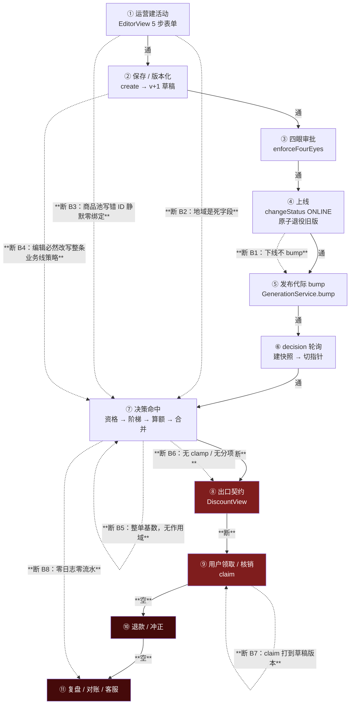

# drools-demo · 活动引擎平台评审报告

> 范围：`activity-common` / `activity-console` / `activity-decision` / `frontend/src/console`。不评 drools-lab 的 Step 1–18。
> 所有结论都对着代码核过，行号为核对当时的实际位置。

---

## 一句话结论

**算钱这一段写得比大多数内部营销中台认真（六形态 fail-closed、向下取整、金标 52 例），但"钱该发给谁、发多少上限、发完怎么停、发过什么记在哪"这四件事全是空的**——最要命的是：**你的下线按钮在生产链路上不生效**（`ActivityMarketingService.java:247-250` 只在上线时推进发布代际），而**控制台自带的验证页恰好走另一条路，会告诉你"已经停了"**（`frontend/src/shared/apiClient.ts:7-12` 里根本没有 decision 这个 service）。这不是"少做了一个功能"，是止损开关和它的仪表盘一起在骗人。

---

## 链路全景与断点

### 断点清单（这是报告的核心，先看这张表）

| # | 断在哪 | 具体表现 | 代码位置 |
|---|--------|---------|---------|
| **B1** | ④→⑤ 下线不传播 | 全仓 `generationService.bump(` 只有一个调用点，且只在上线分支。下线后 decision 快照继续按原配置发钱，直到同 bizLine 有别的活动上线或进程重启 | `ActivityMarketingService.java:247-250`、`ArtifactService.java:71-81`、`GenerationWarmService.warmDueGenerations`（`gen.getGeneration() <= seen → continue`）、`DecisionSnapshot.materialize`（只重判 type + 时间窗，**不重判 activityStatus**） |
| **B2** | ①→⑦ 地域假开关 | `activityAreaType/districtIds` 可编辑、落库、进候选、进快照，**零读取点**；详情页还照样回显 | 控件 `EditorView.vue:604-606`；提交 `:486-487`；落库 `ActivityMarketingService.java:583-584`；搬运终点 `DecisionDataLoader.java:235-236`、`DecisionSnapshotBuilder.java:118`；回显 `DetailView.vue:272` |
| **B3** | ①→⑦ 商品池静默零绑定 | poolId 是裸数字输入框、全仓无任何 pool 查询端点；池不存在/停用时 `continue`，创建返回 200、可上线、永不命中 | `EditorView.vue:672-673`；`ActivityPoolMatchService.java:82-85`；`ActivityMarketingController` 端点清单里无 pool 接口 |
| **B4** | ②→⑦ 策略被静默改写 | `loadForEdit` 不回填 `strategy`，草稿默认恒为 `'MAX'`，而提交体每次都带 `discountStrategy` → **改个错别字就把整条业务线从 STACK 打回 MAX** | `EditorView.vue:81` / `:422-440`（无 strategy 回填）/ `:491`；`ActivityMarketingService.java:183` + `:706-731` upsert |
| **B5** | ⑦ 内部：无作用域 | 活动按 SPU 圈选，减免却算在整单上。9.9 秒杀 + 5000 元电视同车 = 整车 9.9 成交 | `BenefitEvaluator.java:159-167`（FIXED_PRICE 传 `ctx.getOrderAmount()`）、`:171-183`（RATIO_ZHE 同）、`BenefitMath.nthItemDiscount` 全量遍历 lines；`ActivityCandidate` 字段表（`:16-57`）**没有任何 spu/scope 字段** |
| **B6** | ⑦→⑧ 出口契约 | STACK 裸累加、无上限、不与 orderAmount 比较；多活动被压成一个 `hitActivityId`；无 `version` | `BenefitEvaluator.java:239-253`；`ActivityQueryService.java:156`（出口只判 `>0`）、`:298-299`（DiscountView 结构） |
| **B7** | ⑧→⑨ claim 版本错位 | claim 缺省取"最高未删除版本"=草稿；决策取"最高 **ONLINE** 版本"。两边规则不一致 → 扣草稿库存、线上一件不减。UPDATE 谓词还缺状态和时间窗 | `ActivityMarketingService.java:820-827` vs `DecisionDataLoader.java:186-206`；`ActivityManageRepository.java:61-68` |
| **B8** | ⑦→⑪ 零留痕 | 决策路径**零 repository 写入、零业务日志**（类内唯一的 log 是候选数超限 warn）。没有流水表、没有 release、没有金额指标 | `ActivityQueryService.java:110-171`、唯一 log 在 `:121`；`DecisionMetrics` 常量只有 DURATION/FALLBACK/CANDIDATES/COMPILE/CEILING/SOURCE/HIT |
| **B9** | ⑨⑩⑪ 整段空白 | 无券实例、无领取流水、无每人限领执行路径、无退款/冲正（全仓 grep `退款\|refund\|release` 在主源码零命中）、无效果看板 | `persistence/` 下无 grant/redeem/user_coupon 实体 |

**通的部分**：①②③④ 这一截（表单 → 版本化 → 四眼 → 原子指针切换）是真做通了的，`changeStatus:233-243` 的同事务退役写得对。⑤⑥ 的机制也对，只是信号源覆盖不全。**从⑦的出口开始，链路事实上就断了**。

---

## 设计上真正的问题（按严重度）

### P0-1 · 配置变更信号只覆盖"上线"，下线在生产上不生效
**运营 / 风控 / 架构三个角色分别撞到这里，是本次评审重合度最高的一条。**

- **现象**：点下线 → 列表变已下线 → 控制台验证页确认不再命中 → **线上继续发钱**，一直到同 bizLine 有别的活动上线或 decision 重启。
- **根因**：`generation` 被定义成"发布动作计数器"，而快照缓存的是"整条业务线的配置物料"。缓存失效信号必须覆盖所有改变物料的写，现在只覆盖了其中一个动作。而且快照是**正向物化**的（`DecisionSnapshotBuilder.build` 第①步按 `ActivityStatus.ONLINE` 过滤），"后来下线了"这件事在快照的数据结构里根本无法表达——`DecisionSnapshot.materialize` 只重判类型和时间窗。
- **放大器（比原始发现更糟的两点）**：
  1. `DecisionSnapshotStore.forTenant` 按 `tenant|` 前缀返回该租户**全部业务线**的快照，所以"等别人发布顺带修好"还得是**同一条** bizLine 的发布。
  2. console 侧 store 恒空（`snapshotStore.publish` 全仓唯一调用方在 `GenerationWarmService`），所以试算必走库、必显示"已停"——**用来确认止损是否生效的工具，恰好是唯一看不到问题的那条路**。`ListView.vue:200-201` 还写着"下线后该活动立即停止参与决策命中"。
- **代码位置**：`ActivityMarketingService.java:247-250`、`ArtifactService.java:71-81`（`bump` 唯一调用点，且被 `findFirstByActivityIdAndVersion` + NEEDS_REBUILD 早退双重守卫）、`GenerationWarmService.warmDueGenerations`、`DecisionSnapshotStore.java:32-66`、`DecisionDataLoader.java:118-135`。
- **改法**：
  1. `bump` 从 `ArtifactService.onPublish` 里挪出来，改成 `changeStatus` 的事务内动作，**任何** targetStatus 变化都 bump（下线路径绝不能复用那个 artifact 守卫——"规则坏掉的活动"正好是最需要下掉的那个）；`bulkChangeStatus` 每条走同一路径。
  2. 给快照加 `builtAt` 兜底重建（轮询时超过 N 秒强制重建），把"信号漏一次"的后果从**永久**降为**一轮**。这条比第 1 条更值钱。
  3. 补 `activity.decision.snapshot.generation` 与 `.age.seconds` 两个 gauge——现在这个故障在监控上完全不可见，回退率告警不会响，因为它压根没走回退。
  4. 补集成用例：建→上线→建快照→**下线**→断言 decision 不再命中。`SnapshotParityTest` 三个用例全部只做"create→online→publish"，结构上照不出这条。
- **工作量**：S（第 1+2 步）+ S（gauge）

---

### P0-2 · 权益没有"作用域"维度：商品级活动拿整单金额当基数
**营销机制 + 产品两个角色指向同一根因；GAP 那条 `spuId` 降维把最后一条兜底路也堵死了。**

- **现象**：绑定 SPU=A 的"9.9 一口价"，用户车里 A + 5000 元电视 → 减免 = 5009.9 − 9.9 → **整车 9.9 成交**。"指定商品 8 折"配出来就是整单 8 折。第 N 件折更彻底——活动只绑 A，买 2 件 B 也享折。全程无报错、无 warning。
- **根因**：`ActivitySpuBinding` 被定义成**候选筛选器**而不是**权益作用域**。`DecisionDataLoader.boundActivityIds` 用绑定表算出候选 id 后直接 `.distinct()`，绑定信息不再向下传递；`flatten` 组装 `ActivityCandidate` 时不回填"这批活动各自命中了哪些 spuId"。求值层于是只剩 `ctx.getOrderAmount()` 一个标量基数可用。`BenefitMath.Line` 这个 record 本身就没有 spuId 字段——想过滤都没有数据。
- **兜底路也断了**：`DecisionEligibilityService.java:59` 把 `spuId` 属性写成 `req.spuIdList().get(0)` ——只取购物车第一件商品。所以连"用条件树 `spuId == A` 兜一下"都不成立：多商品车里判的是**前端把哪个商品排在了首位**，同样两件商品换个加购顺序结论就不一样。`RuleSchemaRegistry.buildDefaultSchema` 把 spuId 声明为 `NUMBER + {EQ, IN}`，从类型层面就表达不了"购物车里存在某些 SPU"。
- **代码位置**：`BenefitEvaluator.java:159-167` / `:171-183`；`BenefitMath.nthItemDiscount`；`ActivityCandidate.java:16-57`（字段表里有 `activityAreaType`/`districtIds`/`inventory` 这些没人读的，唯独没有绑定集合）；`DecisionDataLoader.java:167-173` / `:209-257`；`DecisionEligibilityService.java:59`；`RuleSchemaRegistry.java:115-116`。
- **改法**：
  1. `flatten` / `DecisionSnapshot.materialize` 给候选补 `Set<Long> scopedSpuIds`（第 1 步的绑定行现成，零额外查询）。
  2. `BenefitEvaluator` 引入 `baseAmount(ctx, candidate)`：有 `lines` 时取命中行小计；**无 lines 时对 FIXED_PRICE / NTH_ZHE 直接 `notApplicable`，不能拿整单顶替**。
  3. `BenefitMath.Line` 加 spuId，`nthItemDiscount` 加 `spuIds` 入参先过滤。
  4. `spuId` 字段改 ARRAY 语义（`CONTAINS/CONTAINS_ANY`），`requestAttributes` 直接 put 整个 `spuIdList`；存量条件树 EQ→CONTAINS 做一次迁移。补一条金标："同一组 SPU 打乱顺序，资格结论必须一致"。
  5. 改不动就先把 `playbooks.ts` 的 flash / second-half / discount 三张卡降级为 `blocked`——它们现在是"可用"，风险远大于不做。
- **工作量**：L
- **顺带**：`FixedPriceAndClaimTest` 里 `fixedPriceDiscount(500, 9.9)=490.10` 已经把这个行为断言成了期望；`NthItemDiscountTest` 的"多行分别计算后求和"同样固化了"活动外商品参与计算"。修的时候这两条要一起改，别被测试挡回去。

---

### P0-3 · 合并策略是 bizLine 全局单值，且**每次编辑都会静默改写它**
- **现象**：运营为改个错别字重编辑任意一个红包活动并保存 → 整条业务线的合并策略被写成 `MAX`。他不需要碰第 5 步任何一下。
- **根因**：`saveStrategyIfPresent` 对 `(bizLine, activityType=null, scene=DISCOUNT)` 那行做 upsert 并 `version+1`，由 `create()` 无条件调用，而 `updateByVersion` 就是 `create`。前端 `loadForEdit` 回填了活动的十几个字段，**唯独没有回填 `strategy`**，草稿默认恒为 `'MAX'`（`newDraft().strategy`），提交体每次都带 `discountStrategy: dr.strategy`。作者自己在 `saveStrategyIfPresent:707` 的注释里写着"discountStrategy 是 bizLine 级的，不是活动自身属性"——但只用它挡住了买赠/加价购，没挡住红包，而红包恰恰是唯一会用到这个策略的类型。
- **额外两条**：① 这个改动**绕开版本/代际/快照整套发布模型**，草稿保存即生效，且没有回滚入口；② 决策侧 `resolveStrategy` 取 `candidates.get(0).getBizLine()`，而快照路径会把该租户**全部业务线**的候选 addAll 到一张列表里——跨业务线的候选混在一起、只按其中一条业务线的策略合并，这是确定的钱算错。
- **代码位置**：`ActivityMarketingService.java:183` / `:706-731`；`EditorView.vue:81` / `:422-440` / `:491` / `:695`；`DecisionDataLoader.java:154-166`；`DecisionSnapshotStore.forTenant`。另：`ActivityStrategyRepository.findFirstByBizLineAndActivityTypeAndSceneAndIsDel`（按活动类型精确匹配那条）全仓**零调用方**——这层设计了但从未接线。
- **改法**：短期 S——从 `create` 里删掉 `saveStrategyIfPresent`，做成独立端点 `PUT /activity-marketing/strategy/{bizLine}`，前端移到业务线设置页并写明影响面（本次修改将影响 N 个在线活动），纳入 `console-write-authority` 与四眼。中期 M——决策入参补 `bizLine`，或按候选的 bizLine 分组分别合并，绝不允许跨业务线共用一套策略。
- **工作量**：S（止血）+ M（正解）

---

### P0-4 · 金额出口既不封顶也不分项
**营销机制 + 客服两个角色从"多发钱"和"记不了账"两头撞到同一行代码。**

- **现象**：三张"满 100 减 50"打在 120 元订单上，返回 `hitAmount=150`，负应付金额直接交给下游。STACK 下三张券各减 10/20/30，返回的是 `hitAmount=60, hitActivityId=A`（A 只是 priority 最小的那个）——**B、C 在响应里彻底不存在**。`GiftResult` 连 `activityId` 都没有，收到一堆赠品名不知道是哪个活动送的。
- **根因**：合并阶段被设计成纯 reduce（"折扣合并是一次 reduce"），而响应形状是从"前端展示一个优惠金额"倒推的，不是从"下游要记一笔账"倒推的。`ActivityRuleResult` 里其实预留了 `benefits` 明细，说明设计时意识到了这个需求，编排层拼 `DiscountView` 时把它截断了。
- **代码位置**：`BenefitEvaluator.java:239-253`（STACK 裸 `total.add`）；`ActivityQueryService.java:156`（出口闸门只判 `hitActivityId != null || hitAmount.signum() > 0`，只有下界没有上界）、`:298-299`（DiscountView 七个字段，无 version、无明细）；`DecisionPlaneController` 全文只是 `ResponseEntity.ok(query.spuDiscount(req))` 透传。
- **改法**（纯增量，不破坏现有客户端）：
  1. 出口统一 `hitAmount = hitAmount.min(orderAmount)`，被截断时打一条 `activity.decision.clamped` 计数——超额本身就是配置事故的信号。这是全报告里性价比最高的一行改动。
  2. `DiscountView` 补 `hitVersion` 与 `items: [{activityId, version, benefitForm, amount, applied, rejectReason}]`，数据源就是 `merge` 之前的 candidates 列表（`computedAmount` / `rejectReason` 都现成）。
  3. `GiftResult` 补 `activityId` + `version`（`DecisionDataLoader:218-223` 构造它时 `g.getActivityId()` 就在手边）。`AddOnOption` 已经带 version 了，以它为模板统一。
  4. 补 `decisionId`（UUID，不落库，纯作对账锚点）。
- **注意**：`AMOUNT` 型在 `orderAmount` 缺省时不能像其它形态那样直接判不适用——红包面额本就与订单金额无关，一律 fail-closed 会改掉现有金标语义。
- **工作量**：M

---

### P0-5 · bizLine 是没有字典的自由文本，却是快照/代际/策略/schema 四重分区键
- **现象**：只要有一个活动 bizLine 留空并发布，decision 就为 `(tenant, null)` 建一份快照——而这份快照的过滤条件是 `if (bizLine != null && !bizLine.equals(...)) continue;`，null 时整个过滤被短路，**该租户所有业务线的线上活动全被收进去**。此后 `forTenant` 把 null 快照和 mall 快照一起返回，`load` 直接 `addAll` 两份、**全链路无任何按 activityId 去重**：同一个买赠活动的赠品发两份，STACK 下同一张券减两次。叠加大小写/空格 typo（`Mall` vs `mall`），策略行、代际行、schema 覆盖、快照桶四样东西一起分叉。
- **根因**：bizLine 引入时是个描述字段，后来被 `ActivityStrategyEntity` / `ActivityGenerationEntity` / `RuleSchemaRegistry.resolve` / `DecisionSnapshotStore` 四处升级成主键的一部分，**入口侧的受控性一次都没跟着升级**。`validateCommon` 至今只校验长度 ≤64 且允许 null。`DecisionSnapshotBuilder` 里那个 `bizLine != null` 本意是"支持一个全局快照"，和 `forTenant` 的"合并全部桶"组合起来就变成了重复计入——两处单独看都自洽。
- **代码位置**：`DecisionSnapshotBuilder.java:75`；`DecisionSnapshotStore.forTenant`（前缀合并）；`DecisionDataLoader.java:118-131`（`cands.addAll` 无去重）；`ActivityMarketingService.java:537`；`EditorView.vue:587`（自由输入）+ `:481`（`dr.bizLine || null`）。
- **改法**：① `bizLine` 改必填 + 受控字典（配置项或 `biz_line` 表），前端换下拉；② `DecisionSnapshotBuilder.build` 拒绝 `bizLine == null`；③ 兜底：`load` 合并多快照后按 activityId 去重，并加一条金标断言"同一 activityId 不得在候选列表出现两次"。
- **工作量**：M

---

### P1-6 · 决策全链路零留痕：客服、财务、风控、算法四条下游同时塌
**客服/对账 + 运营 + 风控三个角色的多条发现最终都收敛到这一条。**

- **现象**：用户投诉"该减 50 只减了 20"，系统里能查到的只有"活动配置**现在**长什么样"。查不到当时问了什么、返回了什么、命中哪个活动、按哪版算的。财务问"这个月发了多少钱"——只能从 Prometheus 的命中**次数**估，因为金额从来没被记录过。
- **根因**："决策服务只读"被理解成了"决策服务不产生任何需要落盘的事实"。但决策本身就是业务事实，它只是不该写**配置库**。而现在这条最便宜的补救路被物理堵死了：decision 连的是只读账号（`deploy/mysql-init/01-decision-readonly-user.sql` 只 `GRANT SELECT`），连自己的流水表都建不了。
- **由此塌掉的四件事及其代码位置**：
  - **无流水**：`ActivityQueryService.java:110-171` 全程无 repository 写入；类内唯一的 log 是 `:121` 的候选数超限 warn。
  - **无金额指标**：`DecisionMetrics` 常量只有 DURATION/FALLBACK/CANDIDATES/COMPILE/CEILING/SOURCE/HIT。`ActivityQueryService.java:106` 手上握着 `v.hitAmount()` 却只打了 `metrics.hit(scene, activityId)`。于是"满 3 减 50"这类误配在监控上是**全盘绿灯**：回退率 0、耗时正常、命中数只是稍高。文档把回退率称作"头号告警项"，但回退只是改变金额的众多方式之一，且是唯一被埋了点的那个。
  - **指标口径 ≠ 业务口径**：`metrics.hit` 全仓唯一调用点在红包出口，**买赠和加价购一次都不打**（`AddOnPurchaseService` 连 `timeDecision` 都没有）；STACK 下只计主活动，其余有真实贡献的活动恒 0。`deploy/grafana/dashboards/activity-services.json` 六个 panel 全是 JVM/HTTP，零业务指标；`prometheus.yml` 无 `rule_files`——"头号告警项"没有任何告警。
  - **"可重放对账"这句话不成立**：确定性随机的种子指纹是 `textAttr("orderAmount") + "|" + textAttr("quantity") + "|" + textAttr("spuId")`（`BenefitEvaluator.drawRandom`），而 `textAttr` 就是 `v.toString()`——客户端传 `100` 和 `100.00` 是**两个不同的种子、两个不同的金额**，这正是确定性随机要消灭的现象。何况重放需要的六个输入全部来自未被记录的请求。`docs/activity-marketing.md:50` 与 `docs/tech-highlights.md:129` 都写着"可重放、可对账"，而 `BenefitMath.randomAmount` 的 javadoc 自己写着"要做真抽奖必须先有发放流水表，当前没有那张表"——同一仓库两处口径打架。
- **改法**（按可交付顺序）：
  1. **当天**：决策出口打一条结构化 JSON 日志（decisionId + 入参 + 逐候选结果 + rejectReason），先把"客服能查"补上。
  2. **一周**：`metrics.amount(scene, activityId, hitAmount)` DistributionSummary（标签复用 `ACTIVITY_TAG_CAP` 那套基数保护）；给 gifts/addon 补 `metrics.hit`；`/by-activity` 响应补 `scope=single-instance` 自述（`/metrics` 有，它没有）。
  3. **一月**：`activity_decision_log` + `activity_decision_item`（命中的和被淘汰的都记），decision 侧独立数据源，异步落盘不阻断热路径。
  4. 指纹立刻规范化：`orderAmount.stripTrailingZeros().toPlainString()`，spuId 用整个列表排序后 join，并在 `RandomAmountTest` 加一条"100 与 100.00 必须抽到同一金额"。
  5. 把 docs 里"可重放对账"降级为"刷新不变价"——它确实做到了这个。
- **工作量**：S（1+4）→ S（2）→ L（3）

---

### P1-7 · 库存与限领这条防线整体空转
- **现象**：写入口对一口价形态**强制要求库存 ≥1**，运营因此确信"配了库存就防超发"。实际上：① 决策侧不读余量，卖光后仍对每个用户报秒杀价（`BenefitEvaluator.java:159-167` 只算额）；② claim 不传 version 时取"最高未删除版本"=草稿，而决策发的是最高 **ONLINE** 版——**防超发闸门装在了另一行数据上**；③ `decrementInventory` 的 WHERE 只有 `activityId/version/isDel/inventory>=n`，**没有状态、没有时间窗**，已下线/未开始/草稿版本的库存都能被扣干净；④ 库存存在版本化配置行上，`(activityId, version)` 是扣减键，线上 v1 与草稿 v2 并存时 v2 冻结的是建草稿那一刻的余量，发布 v2 = 余量倒退；⑤ 每人限领：`ActivityCreateRequest` 里**没有 userInventory 这个字段**，`saveManage` 硬编码 `setUserInventory(0)`，全仓零读取；⑥ 无 release / 无退款冲正（主源码 grep `退款|refund|release` 零命中），取消订单后库存永久蒸发。
- **代码位置**：`ActivityMarketingService.java:816-836`（claim）、`:587`（userInventory=0）、`:765-777`（warnings 只覆盖 inventory）；`ActivityManageRepository.java:61-68`。
- **改法**：一张表解四件事——`activity_grant(grant_id, tenant, activity_id, version, user_id, order_id, quantity, amount, state[HELD|CONFIRMED|RELEASED], decision_id, ...)`，唯一约束 `(tenant, order_id, activity_id)`。claim 签名补 `userId` + `orderId`，先插流水（撞唯一约束=幂等返回）再原子 UPDATE，同事务。同时：`decrementInventory` 补 `activityStatus=1 and :now between start and end`，并且**先**把 version 缺省解析改成"当前 ONLINE 版本"（否则加了状态谓词后所有不传 version 的 claim 会全失败）。余量从 `activity_manage` 拆到 `activity_inventory`，键只到 activityId 不到 version。
- **顺手**：`EditorView.vue:79` 的 `inventory: 100` 改成 null——现在回执会打出"库存（100）当前为声明式"，那个 100 是运营从来没输入过的数字。
- **工作量**：L（这条不做完，任何带库存的玩法上线都是裸奔）

---

### P1-8 · 版本模型缺"当前生效版本"这个一等实体
**运营（回滚做不到）、风控（并发双行）、客服（时间轴查不到）三个角色撞在同一处。**

- **现象四连**：
  1. 无回滚动作：上线按钮恒打 `latestVersion`（`benchModel.ts:111-112`），详情页恒取最高版（`getDetail` 用 `findFirstByActivityIdAndIsDelOrderByVersionDesc`，controller 无 version 参数，也没有版本列表端点）。出事时想抄 v1 的原值都抄不到。
  2. 并发编辑无 DB 兜底：`(tenant_id, activity_id, version)` **没有唯一约束**（`ActivityManageEntity.java:24-33`，`idx_am_aid_ver_del` 是普通索引，唯一约束只有 `uk_am_tenant_request`，而编辑路径 `requestId` 被显式置 null 直接避开它）；`create` 的 ONLINE 分支用 `findFirst...isPresent()` 做 check-then-act，注释自己承认"比软删弱（非原子）"。一旦造出同版本双行，`ruleByKey.putIfAbsent` 关联到哪条规则行由结果集顺序决定——"这张券发多少钱"由查询顺序决定。
  3. 两份 `highestOnline` 推导逐字重复（`DecisionDataLoader.java:186-206` / `DecisionSnapshotBuilder.java:73-79`），任何一处漂移两条路就发不同的钱——历史上"编辑即下线"正是其中一处顺序写反。
  4. 无发布时间轴、无审批人留痕：`activityStatus` 是就地改的，`modifiedStime` 每次被覆盖；`enforceFourEyes` 校验通过后**不写任何字段**。"2026-08-01 10:00 时 ACT001 在线的是 v2 还是 v3""这笔钱是谁批的"库里都没有答案。`ActivityArtifactEntity` 也顶不上（只有 createdStime = 冻结时刻，状态变更无时间戳）。
- **改法**：短期 S——加 `uk_am_tenant_aid_ver` 唯一约束（`create` 捕 `DataIntegrityViolationException` 转 409，与现有 requestId 冲突走同一套映射）；两处 merge 的"version 相等"改成显式按 id 降序取最新（对存量脏数据也生效，唯一约束在已有重复行时反而加不上，所以这条要先做）；加 `activity_publish_log(activity_id, version, action, actor, submitted_by, generation, created_stime)` append-only 表，在 `changeStatus` 同事务里逐条写入（含被动退役的旧版本）。中期 L——`activity_manage` 拆成 `activity`（带 `current_version` 指针）+ `activity_version`（不可变），上线变成一次 CAS，三处推导、退役循环、进程内 rollback 原语一起消失。
- **工作量**：S（三件小事）+ L（结构）

---

### P1-9 · 走库路径丢版本维度，且没人能发现这个分歧
- **现象**：活动上线后把某个 SPU 从绑定列表删掉、保存新版本、上线——**走库路径仍然命中**。快照路径正确。任何**缩小**圈选范围的编辑在走库路径上都失效，方向是单向危险的（扩大范围两条路都生效）。
- **根因**：`boundActivityIds` 用 `findBySpuIdInAndEffectiveAndIsDel(spuIds, ...)` 后 `.map(getActivityId).distinct()`——**version 在第一跳就被丢掉**，指望后面的"取当前线上版本"补回来，补得回活动、补不回绑定关系。而旧版本的绑定行永远是 `effective=1 / isDel=0`（全仓 grep 不到任何对旧版本绑定行的软删）。快照侧是 `findByActivityIdAndVersionAndIsDel` 按版本取的，两条路语义不一致。
- **谁都发现不了**：控制台"优惠验证"页三个通道全部打 console 的 `/activity-marketing/*`——`apiClient.ts:7-12` 的 `ServiceKey` 只有 `'root' | 'marketing'`，**根本没有 decision 这个 service**。而 console 进程 store 恒空必走库。所以运营在验证页看到的永远是走库路径的结论，而线上走的是快照路径。凡是快照侧特有的问题（P0-1 的陈旧快照、这条的绑定收窄、P0-5 的重复候选、轮询延迟）**全部落在验证页照不到的那一侧**。`docs/delivery/promotion-validation-all-playbooks` 那套"全玩法已验证"的证据链，验的也是这条走库路径。
- **代码位置**：`DecisionDataLoader.java:167-173` / `:186-206`；`DecisionSnapshotBuilder.java:136`；`ActivityMarketingService.saveManualBindings`；`frontend/src/console/activityApi.ts:39-49`；`frontend/src/shared/apiClient.ts:7-12`。
- **改法**：① 绑定行在内存里按 `(activityId, version)` 与"当前线上版本"做内连接过滤（不增加查询数，仍是 5 次）；② 验证页改打网关的 `/decision/v1`（nginx 已有前缀分流），响应回显 `source=snapshot|db` + `generation` + `builtAt` 并在 UI 上标出来；更好的做法是**两条路都打并 diff**，把"快照过期"变成运营点一下就能看见的东西；③ `SnapshotParityTest` 补一个场景：v1 绑 A/B → 编辑成只绑 A → 上线 v2 → 对 B 断言两条路都不命中（现有三个用例里唯一做版本化编辑的那个，编辑前后用的是同一个 spu，正好绕开）。
- **工作量**：M

---

### P1-10 · 一屏之内两个地域入口，一真一假；商品池写错 ID 静默零绑定
两条都是"配置得下 ≠ 会执行"，而团队对这个问题**是有意识的**（inventory 就做了置灰 + warning + 回执），只是这两条漏网了。

- **地域**：`EditorView.vue:604-606` 两个完全正常的控件（无 `.declarative` class、无 disabled、无提示），对照同屏 `:596-600` 的库存 label 明确带"声明式 · 决策不扣减"。落库后一路搬到候选和快照，**零判定读取点**。`DetailView.vue:272` 还把它当生效配置回显，给运营做二次确认。而 `playbooks.ts` 的"地域定向立减"卡走的是条件树 `userDistrictId eq 310000`——那条是真的。
  **改法**（S）：保存时把 `areaType=2 + districtIds` 翻译成 `userDistrictId IN (...)` 与用户条件树做 AND，落进同一份 `condition_tree_json`——表单字段立刻变真，决策侧一行不用改。不做翻译就必须删控件 + 并进 `declarativeOnlyWarnings`。绝不能维持现状。
- **商品池**：全仓无任何 pool 的 REST 端点，运营要凭空知道一个整数 poolId；写错时 `findFirstByPoolIdAndEnabledAndIsDel(...).orElse(null); if (rule == null) continue;` → 零绑定 → 创建 200、可上线、永不命中，唯一信号是"自动圈选绑定 0 个"这个小字。**写入口把"引用的外键存不存在"当成了圈选逻辑的一部分，而不是入参校验。**
  **改法**（M）：加 `GET /pools`（带命中数）+ `GET /pools/{id}/preview`，前端换下拉；`savePoolRefsAndAutoBind` 先批量查池，缺失/停用/跨 bizLine → 直接抛异常整事务回滚；`autoBound == 0 && bindMode == pool` 进 warnings 并红字提示。
- **顺带**：池是"保存那一刻的名单快照"不是活的规则（`refreshActivityBinding` 全仓只有一个调用点，在 create 事务里）。前端文案其实是诚实的（"保存时后端按池规则圈选"），缺的只是一个 `POST /{id}/pools/refresh` 重算入口——`refreshActivityBinding` 已经声明幂等可重复执行，几十行的事。

---

### P2-11 · 可解释性停在活动粒度
`DecisionEligibilityService.java:109-111` 拒绝理由是常量 `"不满足资格条件"`，explain 分支只 `traces.add("eligibility reject: " + activityId)`——连同一个对象上现成的 `getActivityName()` 都没带。根因在 `ConditionTreeEvaluator.matches` 返回裸 boolean，`eval`/`evalLeaf` 全私有且只回 boolean，调用方**结构上拿不到**逐叶结果。而算额侧的 `notApplicable` 反而给了"一口价高于订单金额或缺订单金额"这种具体原因——同一条链路两种可解释性水平。

更隐蔽的一层：`"不满足资格条件"` 和 `"资格条件不可判定"`（后者还打了 `metrics.fallback("condition-tree-unavailable")`）是完全不同的两件事——用户不符合 vs **你的活动坏了**——但 trace 前缀一模一样。

**改法**（M）：加一个只在 explain 模式走的重载 `EvalResult matches(root, ctx, schema)`，携带 `List<FailedLeaf>{fieldKey, operator, expected, actual}`（`evalLeaf` 已经能拿到 `SchemaField.label` 和 ctx 实际值），渲染成"订单金额 88.00 < 要求 100"。热路径仍走 boolean 重载，零开销。`DetailView` 顺手把条件树 JSON 渲染成只读条件树组件（`ConditionGroup` 已有），别再给运营看 `{"logic":"AND","children":[...]}`。字段字典只有 6 个，成本极低。

---

### P2-12 · 没有"候选被淘汰"这个指标 + 第 N 件折无次数上限
`BenefitEvaluator.notApplicable` 只调 `c.reject(...)`，不碰任何 metric；`DecisionMetrics` 里没有任何一个计量"候选被淘汰"。热路径 `explain=false`，`rejectReason` 和 trace 两个出口在生产上都不打开。于是"活动上线了但用户说没优惠"在 Grafana 上完全不可见——**只有当这张券是唯一候选时才会走 empty-decision 计一次回退，恰恰是多活动并存这种最容易配错的场景观测全黑**。

**改法**（S，优先级高于本条的另一半）：加 `activity.decision.reject{scene, reason}`，reason 用有限枚举（`ineligible` / `no-ladder-tier` / `missing-lines` / `price-above-order` / `bad-ratio`），在 `notApplicable` 与 `applyJava` 两处唯一出口打点。标签是有限集，无基数风险。**它是"配了但不发"的唯一信号，价值和回退率同级。**

另一半：`BenefitMath.nthItemDiscount` 的 `int discounted = l.quantity() / nth` 无任何上限，买 100 件享 50 件半价。`{"nth":N}` 扩成 `{"nth":N,"maxTimes":M}`，前端 `NthForm` 补"每单最多享几件"并**默认填 1**——运营对"第二件半价"的默认心智就是一单一次。

---

### P2-13 · 四眼在提交人缺失时 fail-open；URL 白名单靠三处手抄
- `enforceFourEyes` 先拒空 actor，再 `actor.equals(row.getSubmittedBy())`——**submittedBy 为 null 时该表达式恒 false，直接放行**。而 `saveManage` 是 `m.setSubmittedBy(ActorContext.get())`，create 路径对 actor 缺失零校验。所以"不带 X-Actor 创建 → 带任意 X-Actor 上线"这条链在代码上是通的。方向刚好反了：真正需要 fail-closed 的是"无从判断这是不是同一个人"。`ActivityFourEyesTest` 四个用例全部先 `ActorContext.callWith("alice", ...)` 建活动，submittedBy=null 这一支零覆盖。修法三行。
- header 档下 `X-Actor` 是纯客户端 header 无任何验证，而除 `e2e:oidc` 外所有脚本都跑在 header 档；四眼开关默认 false。这两点让它是 P1 不是 P0，但"启动期断言 `fourEyesEnabled && !auth.enabled` 直接失败"是个 S 级的正确加固。
- 租户/写权限的边界靠三处硬编码字符串维持（`MultiTenancyConfig:49` 两条、`ActivityResourceServerConfig:52` 两条、`:62-66` 写端点四条），**这套纪律已经失手过两次且都写在注释里**（决策平面漏挂租户过滤器 → A 租户读到别人的活动；bulk-status 漏进写端点白名单）。而 `TenantArchGuardTest` 守的是实体缺 `@TenantId` 和 nativeQuery，唯独不守 URL。**兜底不是"宽松的认证"而是"无认证"**——新增一个新平面前缀会匹配不到链一的 `securityMatcher`，落到 `@Order(2)` 的 `anyRequest().permitAll()`，即完全匿名可访问、header 档下连租户都不解析。
  **改法**（M）：加一个守卫测试，反射扫 controller 包的路径前缀，断言每一个都能被两处模式命中；所有写方法要么在白名单里、要么在显式登记的豁免名单里（preview / spu-discount / gifts / addon）；把那四条字符串提成 `public static final List` 让测试与配置读同一份——这条不是可选项，否则守卫自己会漂移。

---

### P2-14 · Drools 供给链还在，执行方已经没了
生产里唯一还在跑的 DRL 是 `buildGiftDrl` 那条单规则 `gift-collect`，而它与十几行之下的 Java 回退**逐字等价**（DRL 的 LHS `eligible == true, gifts.size() > 0` 对应 `candidates.stream().filter(isEligible).flatMap(getGifts)`，两者输入都是同一份 `applyJava` 淘汰后的候选）。更浪费的是 `GenerationWarmService` 每次代际推进都把全部 ACTIVE artifact 的 `eligDrl` 编译进 KieBase 缓存，而 `evalEligibility` 已经删了——`getEligDrl()` 在 main 里除这一处外**无任何消费方**。按仓库自测的足迹系数（260KB + 37KB×规则数，每份资格 artifact 2 条规则 ≈ 334KB），1000 个活动 ≈ 334MB > 262144KB 预算 → 淘汰 churn，而 churn 下的 classloader/Metaspace 回收是类注释自己承认的未验证项。

**改法**：① S、立刻——删掉预热 `eligDrl` 那段（只保留建快照切指针），`cache-max-weight-kb` 降到 gift 场景实际需要的量级。写平面的 `compileOrGet` 编译校验保留（那是 Drools 编译器作为**校验器**的真实用途），但 `artifact.elig_drl` 明确标注为"审计留痕，非执行输入"。② 定位表态：要么把 `evalGift` 也换成 Java，`activity-common` 的 drools-core/compiler/mvel 依赖整个删掉——**"我用实测足迹数据论证了何时不该上规则引擎"是个比含糊带过强得多的答辩故事**；要么补一个真需要跨规则结论的场景（券叠加互斥矩阵、活动冲突消解、CEP 频控）。**当前中间态是最差的：付了全部成本、拿到零收益。**

---

### P2-15 · 其余（简述，各自有代码位置）
- **抽象轴选错但暂不动**：一个 `redPackageAmount` 四种含义、`red_package_range_amount` 一列三种 JSON（方法注释自己写着"三用途"）、加价购重载 `activity_gift.absoluteAmount`；`DecisionDataLoader.java:213-216` 的 `ruleByKey.putIfAbsent` 让"一活动一权益"成为读侧的单方面截断（DB 层允许多行，多配的行**静默不生效**）。第 4 种玩法只能继续重载。**现在只做两件 S 的事**：写入口拒绝同 `(活动,版本)` 的多规则行；立一条 ADR 钉住"新玩法先补 benefit 表，不许重载判别位"。
- **双份候选装配**：`DecisionDataLoader.flatten` 与 `DecisionSnapshot.CandidateTemplate.toCandidate` 是两份重复实现，`DecisionSnapshot.java:161` 那行注释"漏拷这一行的表现是快照路径不封顶、DB 路径封顶"就是事故记录本身。**抽一个 `CandidateAssembler` 是 S 级改动，直接消掉一整类"同一张券两条路发不同钱"的复发面**，建议从 P2-15 的大改造里拆出来单独先做。
- **快照构建的 N+1**：`DecisionSnapshotBuilder.java:113` 的循环里 `:136` 逐活动查绑定，而同文件规则/赠品/条件行都已 In 批量。加一个 `findByActivityIdInAndIsDel` 即可。影响比想象小（快照命中时决策是零查询，不存在池争用；`fixedDelay` 单线程也不会叠加），但顺手改掉并补一个"数 PreparedStatement"的构建期守护测试。
- **时间维度只有绝对窗口**：`(activityStartTime, activityEndTime)` 一对 Instant，字段字典 6 个里无任何时间字段，`SpuDiscountRequest` 无时间入参、生效窗固定用进程的 `Instant.now()`。于是"每天 20:00-22:00""仅周末"表达不了，事后按"下单当时"重算也做不到。改法：请求补可选 `occurredAt`，字段字典加 `dayOfWeek(IN)` / `timeOfDay(BETWEEN)`（从 occurredAt 派生，复用既有算子，不需要新算子），活动行补 `timezone` 列。
- **圈选是 `demoProductRepo.findAll()` 全表进内存**，且跑在 create 的写事务里（`ActivityPoolMatchService.java:60` + `ActivityMarketingService.java:182`）。几十万 SPU 时保存一个活动 = 一次全表扫 + 一个长事务。引入 `ProductCatalogPort` 接口留缝，判定下推成带 where 的查询。
- **`ListView.vue:361-368` 那块"诚实记账"卡片现在自己在说假话**：写着"指标未按 activityId 打标，控制台也没有对应的聚合接口 · 待建：GET /decision/v1/metrics · GET /by-activity"——`DecisionMetrics` 早就按 activityId 打标了，那两个端点在 `DecisionPlaneController:52/:82` 已经存在。它是仓库里唯一一处会主动说假话的说明文案，对答辩线的伤害比对运营线大（面试官照着 `docs/tech-highlights.md` 追问"你们怎么处理诚实落差"时正好翻到这里）。
- **阶梯落档取"数组里第一个匹配的档"**而不是"满足门槛的最高档"（`BenefitEvaluator.tierOf`），配两档都不填 max 时 500 元订单减 10 不减 50。前端 `TierRuler` 的卡子模型结构上产生不了重叠、`tierLogic.validateTiers` 会 `role="alert"` 红字告警，所以暴露面有限；但 `tierOf` 改成"取 min 最大的匹配档"是单行改动、对不重叠配置行为完全不变，`validateRangeColumn` 顺手加三条档间校验。

---

## 需要重构的（按优先级）

| 优先级 | 改什么 | 为什么必须改 | 落点文件 | 工作量 | 改完解决了谁的问题 |
|---|---|---|---|---|---|
| **P0** | 任何状态变化都 bump 代际 + 快照 `builtAt` 兜底重建 + snapshot generation/age gauge | 下线在生产上不生效，且验证页照不出来。止损开关是断的 | `ActivityMarketingService.java:247-250`、`ArtifactService.java:71-81`、`GenerationWarmService`、`DecisionSnapshotStore`、`DecisionMetrics` | S | 运营（止损）、风控（事故收敛）、SRE（故障可见） |
| **P0** | 出口 `hitAmount.min(orderAmount)` + `activity.decision.clamped` 计数 | 负应付金额没有任何业务惯例能接受；这是全报告最便宜的一行 | `BenefitEvaluator.merge`、`ActivityQueryService.java:156` | S | 风控（资损）、下游订单系统 |
| **P0** | `saveStrategyIfPresent` 从 create 摘除 → 独立业务线设置端点 | 日常编辑必然把整条业务线的 STACK 打回 MAX，且绕开发布模型 | `ActivityMarketingService.java:183/706-731`、`EditorView.vue:491/693-695` | S | 运营、营销机制、所有在线活动 |
| **P0** | 权益作用域：候选带 `scopedSpuIds` + 按 scope 算 baseAmount + `Line` 加 spuId + spuId 改 ARRAY | 商品级活动按整单算钱；一口价会把整车按 9.9 卖掉。且条件树兜底也不成立（只取 `spuIdList.get(0)`） | `DecisionDataLoader.flatten`、`DecisionSnapshot.materialize`、`BenefitEvaluator:159-183`、`BenefitMath`、`DecisionEligibilityService:59`、`RuleSchemaRegistry` | L | 营销机制、产品、风控（这是最大的资损口） |
| **P0** | bizLine 受控字典 + 拒绝 null 快照 + 候选按 activityId 去重 | 一个空业务线的活动会让快照吞下全租户，同一活动被算两遍 | `ActivityMarketingService.java:537`、`DecisionSnapshotBuilder.java:75`、`DecisionDataLoader.java:118-131`、`EditorView.vue:587` | M | 运营、风控、多租户正确性 |
| **P1** | 决策出口结构化日志（当天）→ `activity.decision.amount` 指标（一周）→ `activity_decision_log/item`（一月） | 客服查不了单、财务归因不了、误配在监控上全绿 | `ActivityQueryService.java:106/110-171`、`DecisionMetrics` | S→S→L | 客服、财务、风控、数据 |
| **P1** | `DiscountView` 补 `hitVersion` + `items[]`；`GiftResult` 补 activityId/version | STACK 下另外 N-1 张券在响应里彻底消失，下游连自建流水都建不对 | `ActivityQueryService.java:298-299`、`BenefitEvaluator.merge`、`DecisionDataLoader:218-223` | M | 客服、财务、下游订单系统 |
| **P1** | 走库路径绑定按 `(activityId, version)` 内连接过滤 + `SnapshotParityTest` 补收窄场景 | 缩小圈选范围的编辑在走库路径上失效，两条路结论相反 | `DecisionDataLoader.java:167-173` | M | 运营、决策正确性 |
| **P1** | `activity_grant` 流水表 + claim 补 userId/orderId + 扣减谓词补状态与时间窗 + version 缺省改 ONLINE 版 | 一表解四事：claim 幂等、每人限领、退款冲正、发放对账。当前 claim 打到草稿版本 | `ActivityMarketingService.java:816-836`、`ActivityManageRepository.java:61-68` | L | 风控、客服、财务、运营 |
| **P1** | `uk_am_tenant_aid_ver` 唯一约束 + 两处 merge 相等时按 id 降序 + `activity_publish_log` | 同版本双行会让"发多少钱"由查询顺序决定；四眼审批人不落库=审计上等于没做 | `ActivityManageEntity.java:24-33`、`DecisionDataLoader:186-206`、`DecisionSnapshotBuilder:73-79`、`changeStatus` | S | 风控、审计、客服 |
| **P1** | 地域字段翻译成条件树节点（或删控件 + 进 warnings） | 可编辑、可保存、详情页回显，全链路零读取——配"仅上海"实际全国发 | `ActivityMarketingService.saveCondition`、`EditorView.vue:604-606`、`DetailView.vue:272` | S | 运营 |
| **P1** | 商品池管理端点 + poolId 下拉 + 零绑定硬拒/红字 warning | 写错一个数字：创建成功、上线成功、永不命中，无任何信号 | `ActivityMarketingController`、`ActivityMarketingService.savePoolRefsAndAutoBind`、`EditorView.vue:672-673` | M | 运营 |
| **P1** | 验证页改打 `/decision/v1`（或双打 diff），响应回显 source/generation/builtAt | 用来自证的工具走的是另一条路，快照侧问题一个都照不出 | `apiClient.ts:7-12`、`activityApi.ts:39-49`、`ValidateView.vue` | M | 运营、QA、交付证据链 |
| **P2** | `activity.decision.reject{scene,reason}` 计数器 | "配了但不发"的唯一信号；多活动并存时观测全黑 | `BenefitEvaluator.notApplicable`、`DecisionEligibilityService.applyJava`、`DecisionMetrics` | S | 运营、SRE |
| **P2** | `ConditionTreeEvaluator` explain 重载（逐叶失败原因）+ 详情页条件树只读渲染 | 客服/运营永远无法自证系统坏了，也分不清"用户不符合"和"你的活动坏了" | `ConditionTreeEvaluator:51`、`DecisionEligibilityService:99-111`、`DetailView.vue` | M | 客服、运营 |
| **P2** | 抽 `CandidateAssembler` 消灭双份候选装配 | `DecisionSnapshot.java:161` 那行注释就是上一次事故的记录 | `DecisionDataLoader.flatten`、`DecisionSnapshot.CandidateTemplate` | S | 所有人（防复发） |
| **P2** | 删掉 `eligDrl` 预热 + 降 cache 预算；对 Drools 定位明确表态 | 为一条已删除的执行路径付全部内存与 Metaspace 成本 | `GenerationWarmService:103-110`、`ActivityRuleRuntimeService` | S | 答辩自洽、运行成本 |
| **P2** | 四眼补 fail-closed（submittedBy 为空即拒）+ create 强制 actor + 启动期断言 | 不带 X-Actor 创建 → 任意人上线，三行代码的洞 | `ActivityMarketingService.java:313-321/592` | S | 风控、审计 |
| **P2** | Controller 路径守卫测试 + 写方法登记制 + 白名单常量共享 | 同类事故已发生两次，没有任何机制阻止第三次；兜底链是 `permitAll` | `ActivityResourceServerConfig`、`MultiTenancyConfig`、新增守卫测试 | M | 安全、多租户 |
| **P2** | `POST /{id}/pools/refresh` 重算入口 + PoolRef 加 mode 字段 | 池是保存那刻的名单快照，活动期内新品永远进不来 | `ActivityPoolMatchService`（已幂等）、controller | S | 运营 |
| **P2** | `tierOf` 取最高门槛档 + `validateRangeColumn` 加档间校验 | 两档都不填 max 时 500 元订单减 10 不减 50 | `BenefitEvaluator.tierOf`、`ActivityMarketingService:510-526` | S | 运营、营销机制 |
| **P2** | 详情/编辑/发布支持显式 version + `/versions` 列表 + 版本切换器 | 出事时看不到线上那一版的原值，只能靠记忆重配 | `ActivityMarketingService.getDetail`、`ActivityMarketingController:124`、`benchModel.ts:111` | M | 运营 |
| **P3** | 权益一等公民：`activity_benefit(activity_id, version, seq, form, scope, params_json, cap)` | 现在加第 4 种玩法只能继续重载判别位/重载赠品表 | 数据模型 + `BenefitEvaluator` + 快照构建 + 52 例金标 | L | 未来的自己 |

---

## 不必改的 / 刻意取舍

以下几条看起来像缺陷，其实是对的判断或已被显式声明，**不要因为这份报告去动它们**：

1. **决策只报价、claim 才提交**——分工正确，decision 连只读账号是对的。`claim` 全仓没有生产调用方**不是漏接**：这个仓库里根本没有下单/结算服务，claim 按设计就是给外部订单系统调的边界 API，前端 e2e 还专门断言 `claimRequests.length === 0`（"验证页不得占库存"是被守住的正确行为）。
2. **3 秒轮询延迟**——营销场景够用，比分布式事务的选择正确。要修的是"信号没发出去"，不是"信号传得慢"。
3. **`ACTIVITY_TAG_CAP = 200` + `__over_cap__` 哨兵**——正确的工程判断，且响应里原样带出不隐藏。它恰恰证明了 Prometheus 不该承担业务口径（第 201 个活动的效果数据会消失进哨兵，而大促正是活动最多的时候）——所以业务数据应该走流水表，不是去掉这个 cap。
4. **`/decision/v1/metrics` 的单实例口径已在响应里显式声明**（`scope=single-instance`）。要补的只是 `/by-activity` 也带上，不是重做指标体系。
5. **快照构建期不过滤时间窗**（留给请求时判）——刻意设计且正确，所以"活动自然到期"仍会停发，陈旧只发生在人工下线/改配。
6. **MUTEX 与 PRIORITY 行为等价**——`StackStrategy` 枚举注释、`merge` 方法注释、CLAUDE.md 三处都白纸黑字写了"互斥单选，语义相同"，是**已声明的建模简化**不是失配。要做的只有半件：从前端 chip 里移除 MUTEX（保留枚举做兼容映射，真删枚举值会破坏历史库里的行），别让运营在两个结果一模一样的词之间做选择。
7. **`userInventory` 是 dead column，不是资损通道**——它连提交入口都没有（`ActivityCreateRequest` 无此字段），运营看不到它、配不了它，不存在"以为生效"的陷阱。将来实现时一条 UPDATE 刷成 NULL 即可。别为它单独排期，跟 `activity_grant` 一起做。
8. **`ActivityType` 里的 COUPONS(2)/CPS(3)/RIGHT_COUPON(4)**——枚举类注释第 6-7 行原文就写着"保留枚举位但不实现链路"，写平面白名单又只放行 `[1,5,6]`。留着不体面，但不是无标注的陷阱。加个 `@Deprecated` 就够了。
9. **playbooks 的 blocked 分组为空**——`playbooks.test.ts` 里有明确注释说明这是"三张卡已解锁"的有意识决定，且 `PlaybooksView.vue:29` 会过滤掉 count=0 的分组（运营看不到空 tab）。真正的护栏（`isReady` 从 `CREATABLE_ACTIVITY_TYPES` 推导）还在守着。补 blocked 卡是产品向的改进，不是修 bug。
10. **"阶梯 + 底价"的覆盖语义**——控制台**造不出**这种组合（`LadderForm` 根本没有底价输入框，`changeRedMode` 切到 ladder 时第一件事就是 `dr.amount = ''`），只有 API 直连或历史数据才有。属于兼容而非活的功能，`logic.roundtrip.test.ts` 那条注释也是对的。
11. **"decision 结构上写不了"这句 javadoc 不是谎言**——它限定的主语是 `ActivityMarketingService/ArtifactService/GenerationService` 三个 bean，那三个确实不在 classpath 上。`ActivityPoolMatchService` 虽然是 decision 容器里的一个 bean，但**没有任何代码调用它**。这是"common 未按消费方拆分"的技术债，不是活跃的安全缺陷——按 P2 排，别当火警。
12. **移出 Drools 的判据本身**（"这条规则需不需要其它规则的结论"）——这是本仓库最值钱的技术决策，答辩里最能打的部分。要改的是执行只做了一半（残留供给链），不是这个判断。

---

## 两条线的分别建议

### (A) 作为求职作品 / 技术答辩

**最该补的三件（按性价比）**：

1. **下线传播 + snapshot generation/age gauge**（S）。"你怎么止损"是营销系统面试的必问题，现在的真实答案是"停不下来，而且控制台会告诉你已经停了"。修完之后这条反而变成加分项：*"我们用发布代际做跨进程缓存失效，踩过一个坑——信号只覆盖了上线不覆盖下线，正向物化的快照在数据结构上表达不了'后来下线了'，我加了 builtAt 兜底把'信号漏一次'的后果从永久降为一轮，并补了 generation/age 两个 gauge 让它可见。"* 这是一个有深度的故事。
2. **权益作用域**（L，但可以先做前两步）。"购物车里还有台 5000 元的电视呢"——面试官问出这句话只需要三秒，而你现在没有答案。哪怕先把 flash/second-half/discount 三张卡降级为 blocked 并写清原因，也比"12 张卡全部可用"强。
3. **决策出口结构化日志 + `activity.decision.amount` 指标**（S+S，一天）。补完之后你能回答"客服怎么查单""发了多少钱""怎么发现运营配错了"三个问题，而这三个问题现在的答案都是"查不了"。

**面试官最可能从这些地方问穿**（按被问到的概率排）：

| 追问 | 现在会发生什么 |
|---|---|
| "你们线上真正跑的 DRL 有几条规则？" | 一条 `gift-collect`，而且与 Java 回退逐字等价。**但预热还在编译全部资格 DRL，没有任何执行方** |
| "确定性随机你说可重放对账——重放需要的输入存在哪？" | `docs/activity-marketing.md:50` 说可对账，`BenefitMath.randomAmount` 的 javadoc 说"没有那张表"。同一仓库两处口径打架 |
| "STACK 命中三张券，订单系统怎么核销？" | 响应里只有一个 `hitActivityId` + 一个总额，另外两张不存在 |
| "四眼审批的记录在哪？" | `enforceFourEyes` 校验通过后不写任何字段。而且 submittedBy 为空时它**恒放行** |
| "回退率是头号告警项——告警配在哪？" | `prometheus.yml` 无 `rule_files`，Grafana 六个 panel 全是 JVM/HTTP |
| "秒杀卖完了决策侧怎么知道？" | 不知道，`inventory` 一路拷进候选但零读取方 |
| "控制台这块卡片写着两个端点待建？" | 那两个端点已经实现半年了（`DecisionPlaneController:52/:82`），这是仓库里唯一一处主动说假话的文案 |

**顺带**：`docs/tech-highlights.md` 的"已知落差"小节是加分项，保持。但要把上面这几条**新的**落差补进去——落差清单的价值在于它是完整的，一旦被发现漏了一条，整个"诚实性"叙事就塌了。

### (B) 作为真要接运营的活动平台

**不可跳过的前置**（按依赖顺序，缺一条都不能上任何带金额或带库存的玩法）：

1. **止损可用**：下线传播（S）+ 决策侧手动刷新/回滚的管理端点（S）。没有这条，任何配置错误都是无限期的。
2. **金额上界**：出口 clamp（S）+ `activity.decision.amount` 指标 + 突增告警（S）。"满 3 减 50"这类误配现在从写入口到决策出口一道闸都碰不到，且监控全绿。
3. **作用域**（L）。在这条修好之前，每加一种新玩法都是在放大同一个漏洞。
4. **策略移出活动编辑器**（S）。现在"改错别字"这个动作会改写整条业务线的发钱规则。
5. **发放流水 `activity_grant`**（L）。claim 幂等、每人限领、退款冲正、财务对账是同一张表的四个视图。没有它，第 6 条也做不了。
6. **决策流水 `activity_decision_log`**（L）。客服、风控、算法三条下游的唯一数据源。
7. **唯一约束 + 发布日志**（S）。并发编辑的 DB 兜底、审批人留痕、"T 时刻哪版在线"。
8. **bizLine 受控字典**（M）。它是四重分区键，不能是自由文本。
9. **验证页打 decision 平面**（M）。否则你的所有验收证据都验的是另一条路。

**明确不要做的**：新玩法（作用域修好前每加一种都是放大漏洞）、权益表大重构（先立 ADR 钉方向）、效果看板（没有流水表就是无源之水）。

---

## 如果只做三件事

### 1. 让下线真的生效，并让快照的陈旧程度可见
`changeStatus` 任何状态变化都 bump（下线路径不经 artifact 守卫）+ 快照 `builtAt` 兜底重建 + `snapshot.generation` / `snapshot.age.seconds` 两个 gauge + 一条"上线→建快照→下线→断言不命中"的集成用例。
**为什么是它**：它是链路上唯一一个**"错误无法被终止"**的缺陷。其它所有问题都能靠"发现后停掉活动"止损，而这一条恰恰打掉了止损本身；更毒的是控制台的验证页会告诉你已经停了。成本 S。

### 2. 权益作用域：候选带上 `scopedSpuIds`，spuId 改 ARRAY 语义
`flatten` / `materialize` 回填绑定集合 → `baseAmount(ctx, candidate)` 按 scope 算基数（无 lines 时 FIXED_PRICE/NTH_ZHE 直接不适用）→ `BenefitMath.Line` 加 spuId → `requestAttributes` put 整个 `spuIdList`、schema 改 `CONTAINS`。
**为什么是它**：这是链路上**单笔金额错得最离谱**的一条（整车按 9.9 卖），且没有任何 workaround——连"用条件树 spuId==A 兜一下"都因为 `get(0)` 而不成立。它同时是面试作品线上最容易被一句话问穿的洞。成本 L，但前两步（带 spuId + FIXED_PRICE/NTH_ZHE 强制 LINE 级）就能堵住最大的口子。

### 3. 金额出口三件套：clamp + `items[]` 明细 + `amount` 指标 / 结构化日志
出口 `hitAmount.min(orderAmount)` 并打 `clamped` 计数；`DiscountView` 增量补 `hitVersion` 和逐活动明细（数据在 merge 里全是现成的，只是被丢掉了）；`metrics.amount(scene, activityId, hitAmount)`；决策出口打一条结构化 JSON 日志。
**为什么是它**：这一处同时堵住三个洞——**发多了**（clamp）、**记不了账**（items + 日志）、**发错了没人知道**（amount 指标是运营误配唯一的观测信号）。四件事加起来成本 S~M，是全报告杠杆最高的一批改动，而且全部是纯增量、不破坏任何现有客户端。

---

**这三件的共同点**：一件让错误能被**终止**，一件让钱发在**对的范围**，一件让钱发得**有上限且留痕**。它们合起来把这条链路从"算得准但停不下、查不到、管不住"变成"可运营"。剩下的（版本模型、权益一等公民、DRL 清理、池管理面）都是在这三件做完之后才谈得上的事。